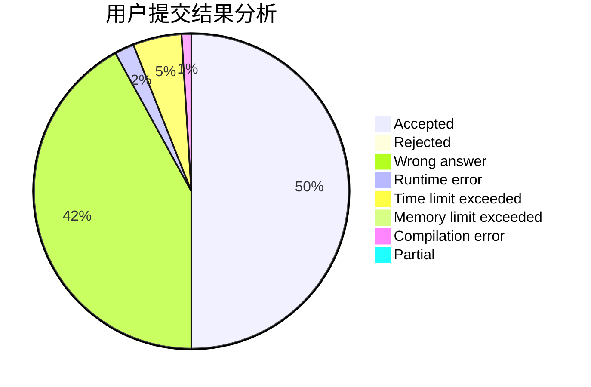
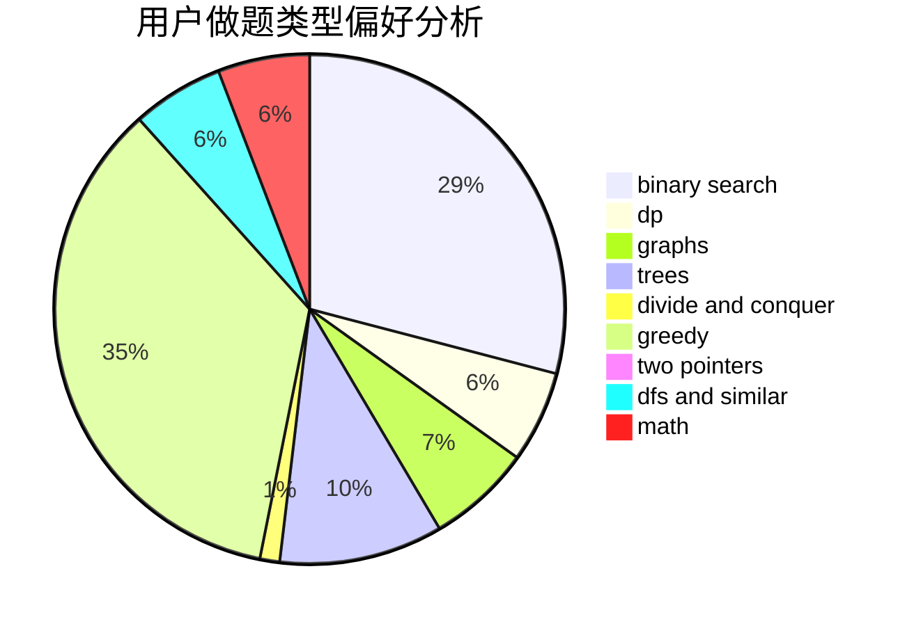

# gisp_zjz

<!-- tabs:start -->

#### **用户提交结果分析**

#### **用户做题类型偏好分析**

<!-- tabs:end -->
# 推荐题目
[27D](https://codeforces.com/contest/27/problem/D)
[463C](https://codeforces.com/contest/463/problem/C)
[835C](https://codeforces.com/contest/835/problem/C)
[370A](https://codeforces.com/contest/370/problem/A)
[1298D](https://codeforces.com/contest/1298/problem/D)
[429A](https://codeforces.com/contest/429/problem/A)
[680B](https://codeforces.com/contest/680/problem/B)
[1172A](https://codeforces.com/contest/1172/problem/A)
[164C](https://codeforces.com/contest/164/problem/C)
[388E](https://codeforces.com/contest/388/problem/E)
