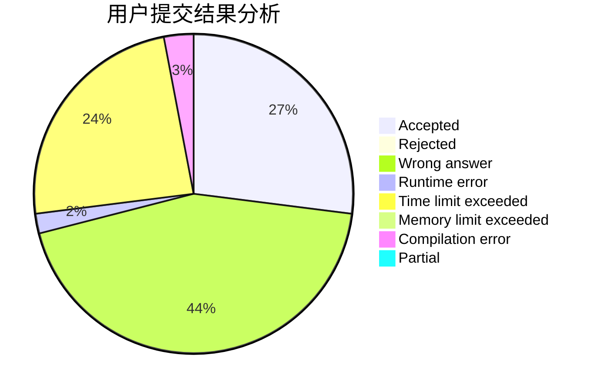
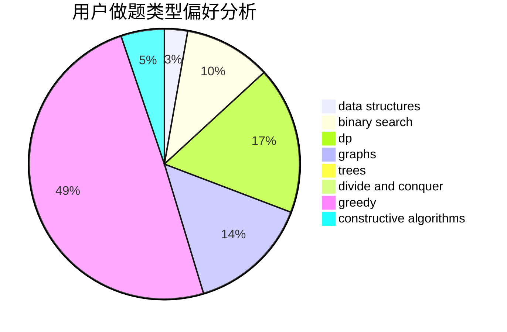
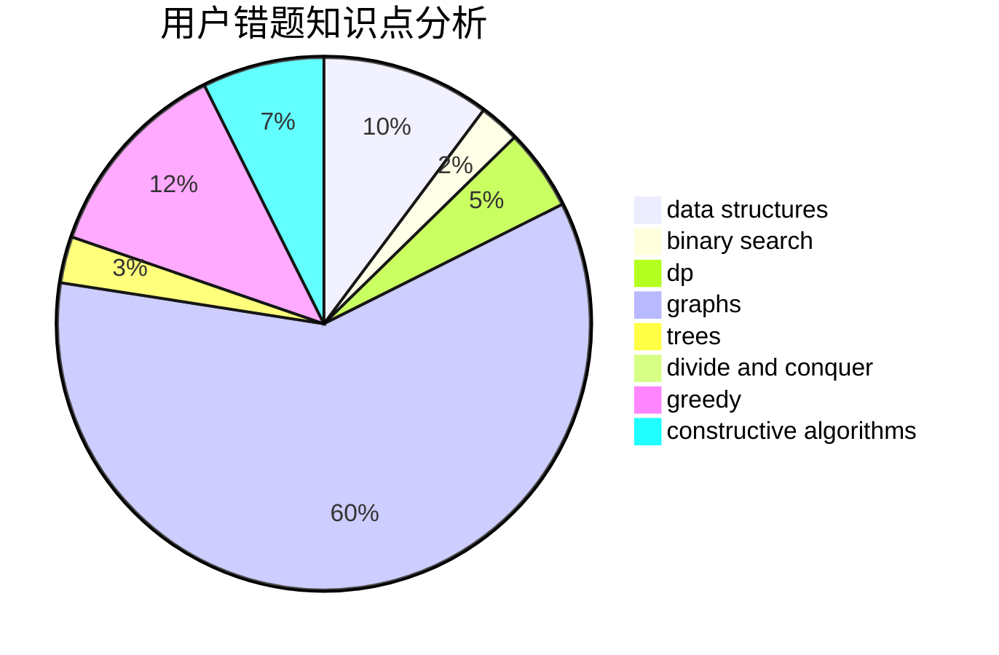

# gjghfd

<!-- tabs:start -->

#### **用户提交结果分析**

#### **用户做题类型偏好分析**

#### **用户错题知识点分析**

<!-- tabs:end -->
# 推荐题目
[1215A](https://codeforces.com/contest/1215/problem/A)		greedy,
                        implementation,
                        math		  
[401C](https://codeforces.com/contest/401/problem/C)		constructive algorithms,
                        greedy,
                        implementation		  
[870A](https://codeforces.com/contest/870/problem/A)		brute force,
                        implementation		  
[719A](https://codeforces.com/contest/719/problem/A)		implementation		  
[316A1](https://codeforces.com/contest/316A/problem/1)		greedy		  
[702F](https://codeforces.com/contest/702/problem/F)		data structures		  
[38G](https://codeforces.com/contest/38/problem/G)		data structures		  
[316B1](https://codeforces.com/contest/316B/problem/1)		brute force,
                        dfs and similar		  
[1073G](https://codeforces.com/contest/1073/problem/G)		data structures,
                        string suffix structures		  
[952B](https://codeforces.com/contest/952/problem/B)		brute force,
                        interactive		  
