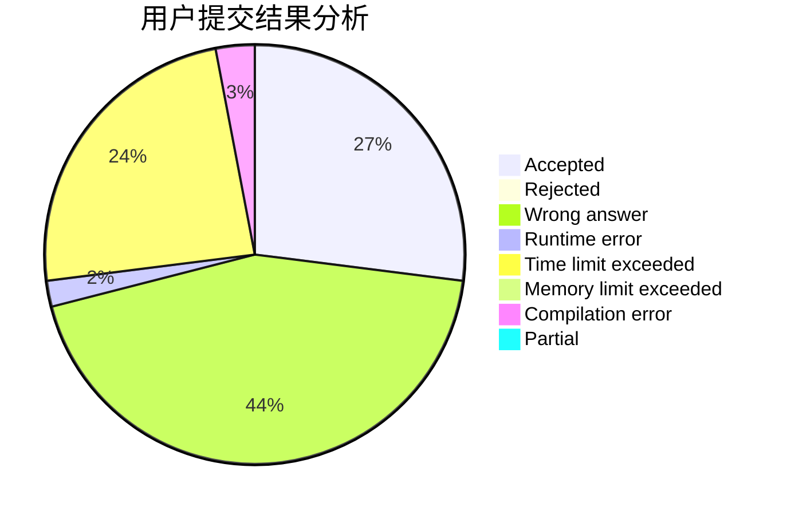
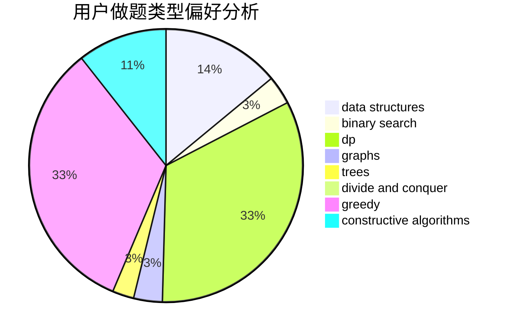
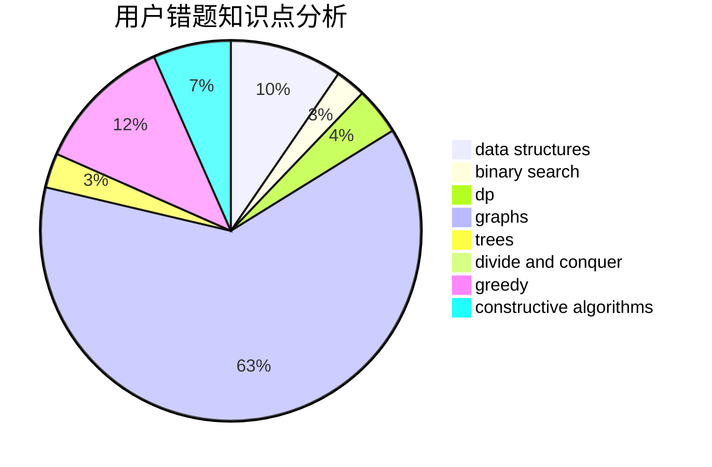

# gjghfd

<!-- tabs:start -->

#### **用户提交结果分析**

#### **用户做题类型偏好分析**

#### **用户错题知识点分析**

<!-- tabs:end -->
# 推荐题目
[1220E](https://codeforces.com/contest/1220/problem/E)		dfs and similar,
                        dp,
                        dsu,
                        graphs,
                        greedy,
                        trees		  
[42C](https://codeforces.com/contest/42/problem/C)		brute force,
                        constructive algorithms		  
[890B](https://codeforces.com/contest/890/problem/B)		dsu,graphs,sortings,trees		  
[736B](https://codeforces.com/contest/736/problem/B)		dsu,graphs,sortings,trees		  
[339E](https://codeforces.com/contest/339/problem/E)		constructive algorithms,
                        dfs and similar,
                        greedy		  
[721D](https://codeforces.com/contest/721/problem/D)		constructive algorithms,
                        data structures,
                        greedy,
                        math		  
[41E](https://codeforces.com/contest/41/problem/E)		constructive algorithms,
                        graphs,
                        greedy		  
[33C](https://codeforces.com/contest/33/problem/C)		greedy		  
[1074C](https://codeforces.com/contest/1074/problem/C)		dsu,graphs,sortings,trees		  
[975A](https://codeforces.com/contest/975/problem/A)		implementation,
                        strings		  
