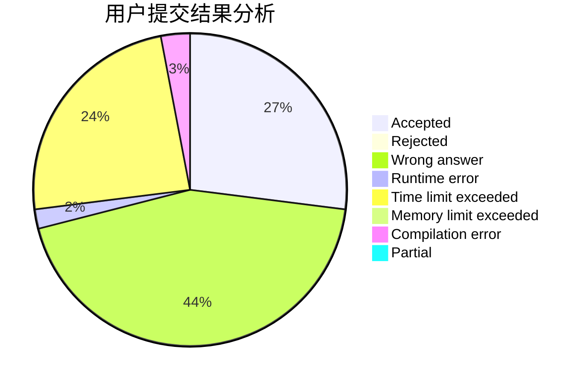
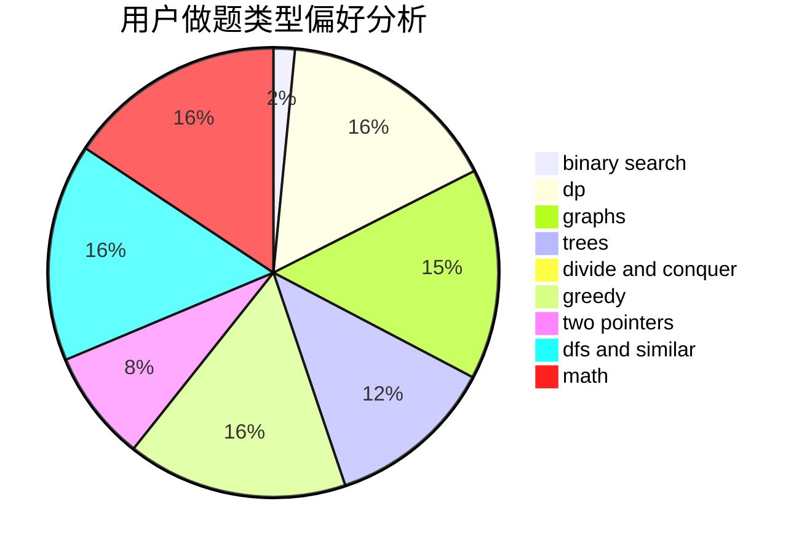

# gjghfd

<!-- tabs:start -->

#### **用户提交结果分析**

#### **用户做题类型偏好分析**

<!-- tabs:end -->
# 推荐题目
[1220E](https://codeforces.com/contest/1220/problem/E)
[42C](https://codeforces.com/contest/42/problem/C)
[890B](https://codeforces.com/contest/890/problem/B)
[736B](https://codeforces.com/contest/736/problem/B)
[339E](https://codeforces.com/contest/339/problem/E)
[721D](https://codeforces.com/contest/721/problem/D)
[41E](https://codeforces.com/contest/41/problem/E)
[33C](https://codeforces.com/contest/33/problem/C)
[1074C](https://codeforces.com/contest/1074/problem/C)
[975A](https://codeforces.com/contest/975/problem/A)
