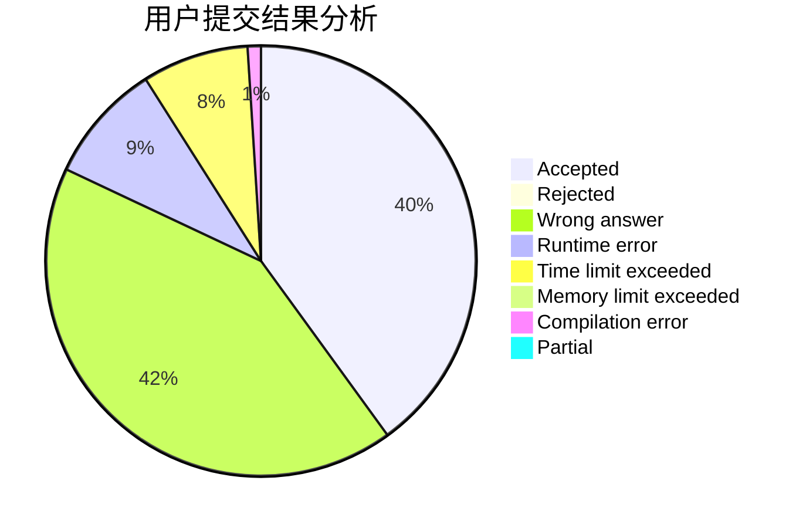
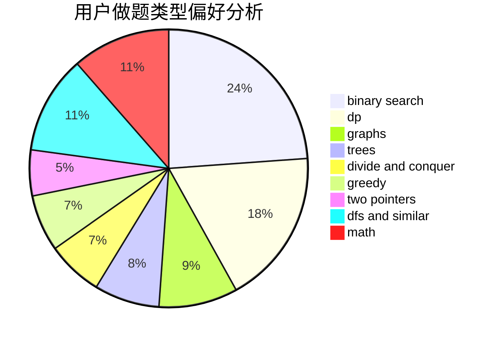

# gjy5885

<!-- tabs:start -->

#### **用户提交结果分析**

#### **用户做题类型偏好分析**

<!-- tabs:end -->
# 推荐题目
[936A](https://codeforces.com/contest/936/problem/A)
[1393D](https://codeforces.com/contest/1393/problem/D)
[645F](https://codeforces.com/contest/645/problem/F)
[136C](https://codeforces.com/contest/136/problem/C)
[306B](https://codeforces.com/contest/306/problem/B)
[678F](https://codeforces.com/contest/678/problem/F)
[490B](https://codeforces.com/contest/490/problem/B)
[1188C](https://codeforces.com/contest/1188/problem/C)
[1237G](https://codeforces.com/contest/1237/problem/G)
[1008D](https://codeforces.com/contest/1008/problem/D)
