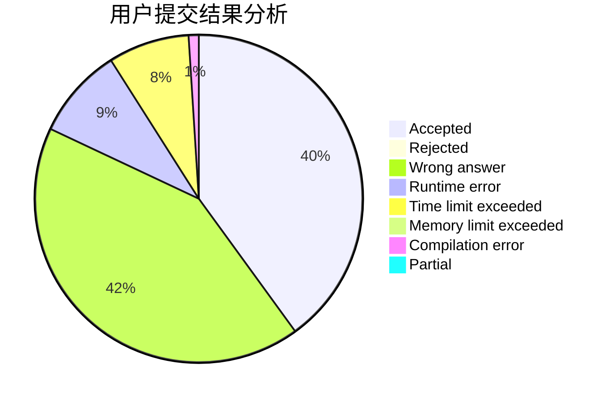
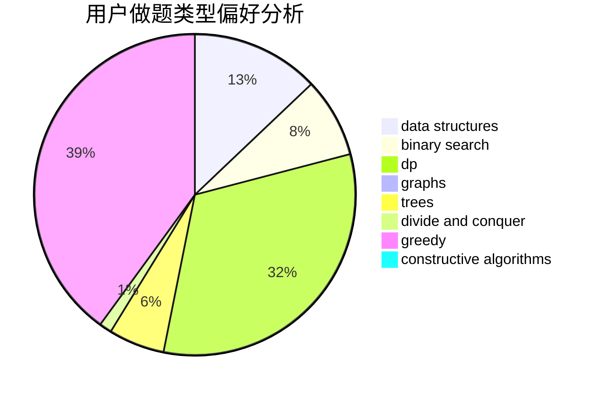
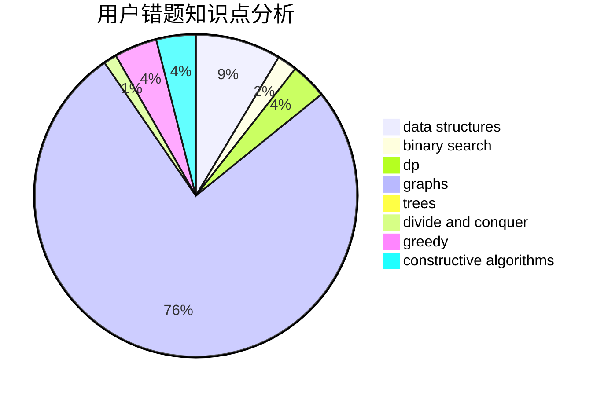

# gjy5885

<!-- tabs:start -->

#### **用户提交结果分析**

#### **用户做题类型偏好分析**

#### **用户错题知识点分析**

<!-- tabs:end -->
# 推荐题目
[916A](https://codeforces.com/contest/916/problem/A)		brute force,
                        implementation,
                        math		  
[1384A](https://codeforces.com/contest/1384/problem/A)		constructive algorithms,
                        greedy,
                        strings		  
[621D](https://codeforces.com/contest/621/problem/D)		brute force,
                        constructive algorithms,
                        math		  
[1362D](https://codeforces.com/contest/1362/problem/D)		dsu,graphs,sortings,trees		  
[291B](https://codeforces.com/contest/291/problem/B)		*special problem,
                        implementation,
                        strings		  
[656F](https://codeforces.com/contest/656/problem/F)		*special problem		  
[472A](https://codeforces.com/contest/472/problem/A)		math,
                        number theory		  
[1184E1](https://codeforces.com/contest/1184E/problem/1)		graphs,
                        trees		  
[1229C](https://codeforces.com/contest/1229/problem/C)		dsu,graphs,sortings,trees		  
[1008A](https://codeforces.com/contest/1008/problem/A)		implementation,
                        strings		  
