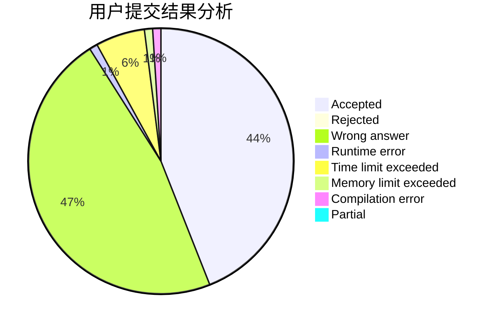
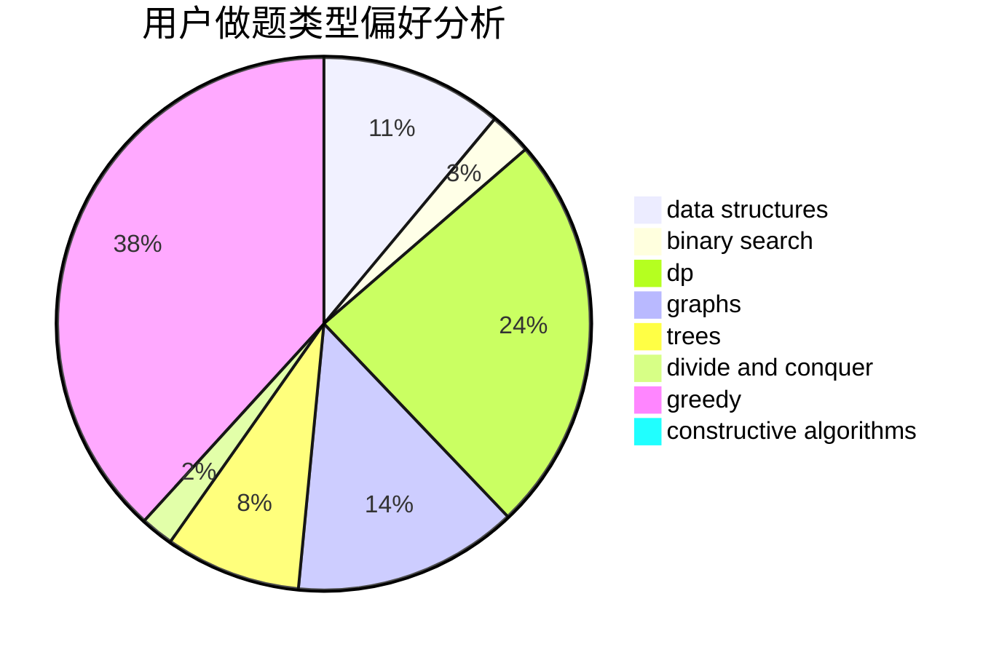
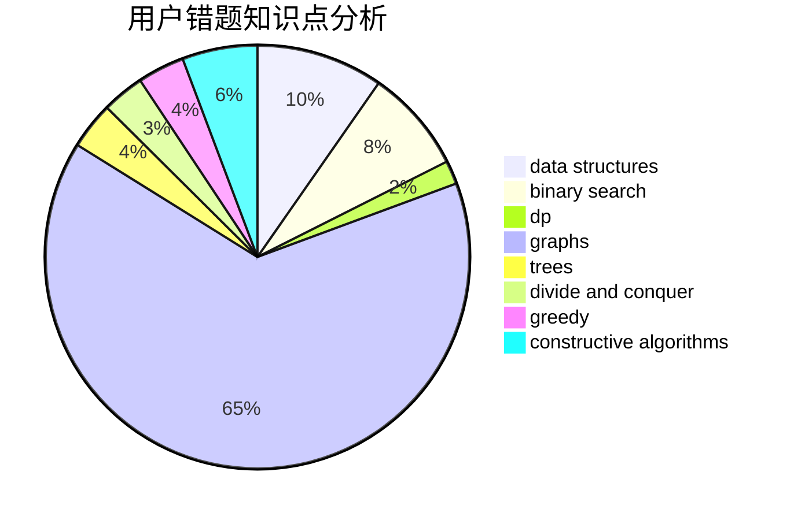

# glancing_back

<!-- tabs:start -->

#### **用户提交结果分析**

#### **用户做题类型偏好分析**

#### **用户错题知识点分析**

<!-- tabs:end -->
# 推荐题目
[185A](https://codeforces.com/contest/185/problem/A)		math		  
[1108A](https://codeforces.com/contest/1108/problem/A)		implementation		  
[878A](https://codeforces.com/contest/878/problem/A)		bitmasks,
                        constructive algorithms		  
[691D](https://codeforces.com/contest/691/problem/D)		dfs and similar,
                        dsu,
                        math		  
[782E](https://codeforces.com/contest/782/problem/E)		dsu,graphs,sortings,trees		  
[1020C](https://codeforces.com/contest/1020/problem/C)		dsu,graphs,sortings,trees		  
[789D](https://codeforces.com/contest/789/problem/D)		dsu,graphs,sortings,trees		  
[501C](https://codeforces.com/contest/501/problem/C)		constructive algorithms,
                        data structures,
                        greedy,
                        sortings,
                        trees		  
[281A](https://codeforces.com/contest/281/problem/A)		implementation,
                        strings		  
[1045J](https://codeforces.com/contest/1045/problem/J)		data structures,
                        strings,
                        trees		  
