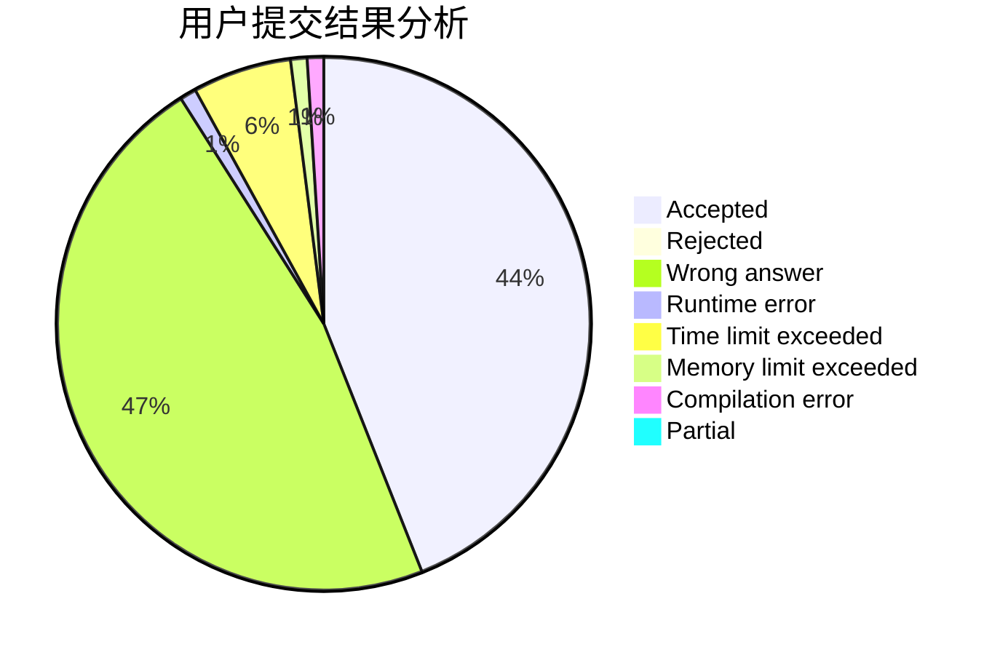
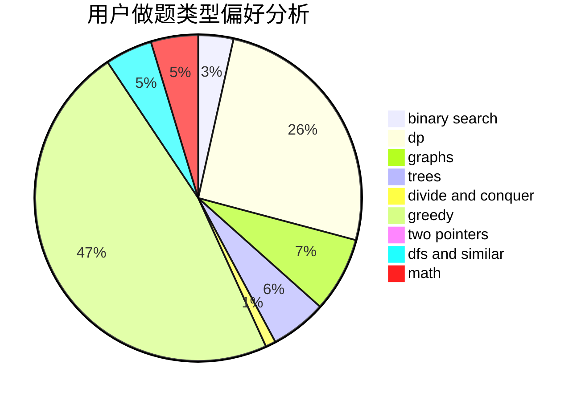

# glancing_back

<!-- tabs:start -->

#### **用户提交结果分析**

#### **用户做题类型偏好分析**

<!-- tabs:end -->
# 推荐题目
[185A](https://codeforces.com/contest/185/problem/A)
[1108A](https://codeforces.com/contest/1108/problem/A)
[878A](https://codeforces.com/contest/878/problem/A)
[691D](https://codeforces.com/contest/691/problem/D)
[782E](https://codeforces.com/contest/782/problem/E)
[1020C](https://codeforces.com/contest/1020/problem/C)
[789D](https://codeforces.com/contest/789/problem/D)
[501C](https://codeforces.com/contest/501/problem/C)
[281A](https://codeforces.com/contest/281/problem/A)
[1045J](https://codeforces.com/contest/1045/problem/J)
