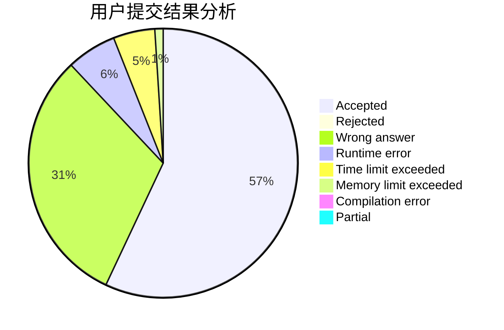
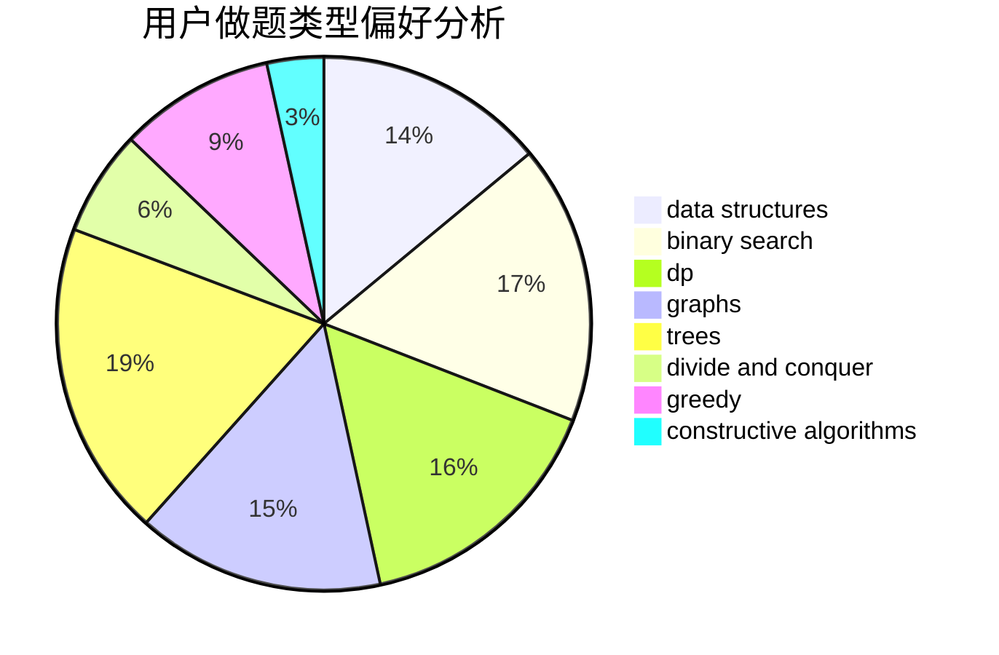

# AyoAyowei

<!-- tabs:start -->

#### **用户提交结果分析**

#### **用户做题类型偏好分析**

#### **用户错题知识点分析**

<!-- tabs:end -->
# 推荐题目
[304D](https://codeforces.com/contest/304/problem/D)		dsu,graphs,sortings,trees		  
[1310B](https://codeforces.com/contest/1310/problem/B)		dp,
                        implementation		  
[1307D](https://codeforces.com/contest/1307/problem/D)		binary search,
                        data structures,
                        dfs and similar,
                        graphs,
                        greedy,
                        shortest paths,
                        sortings		  
[472G](https://codeforces.com/contest/472/problem/G)		bitmasks,
                        data structures,
                        fft		  
[1154D](https://codeforces.com/contest/1154/problem/D)		greedy		  
[1138E](https://codeforces.com/contest/1138/problem/E)		dsu,graphs,sortings,trees		  
[158E](https://codeforces.com/contest/158/problem/E)		*special problem,
                        dp,
                        sortings		  
[476C](https://codeforces.com/contest/476/problem/C)		math		  
[319A](https://codeforces.com/contest/319/problem/A)		combinatorics,
                        math		  
[474B](https://codeforces.com/contest/474/problem/B)		binary search,
                        implementation		  
