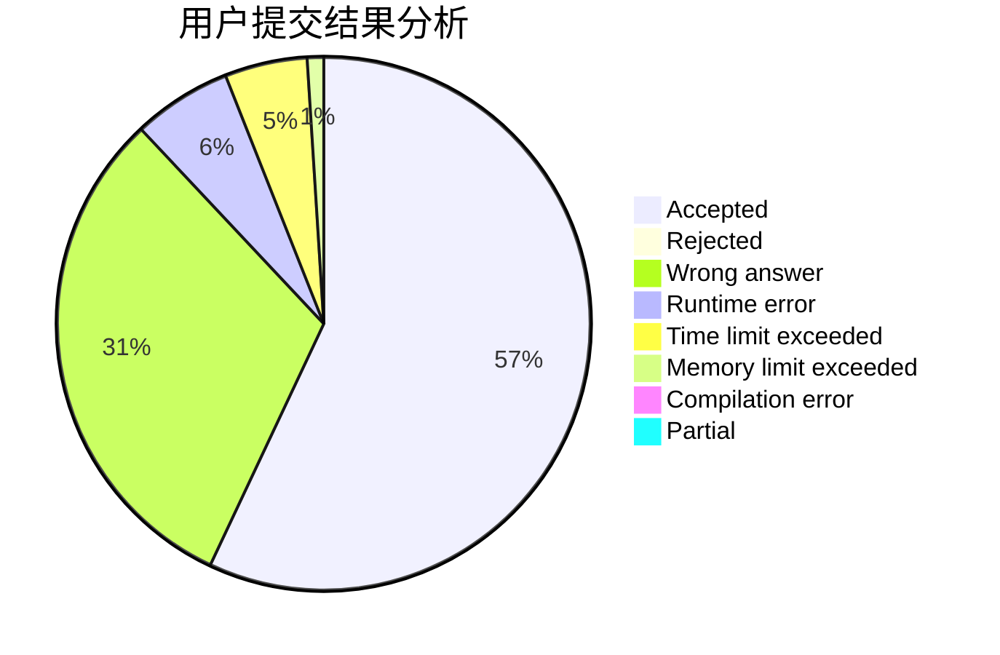
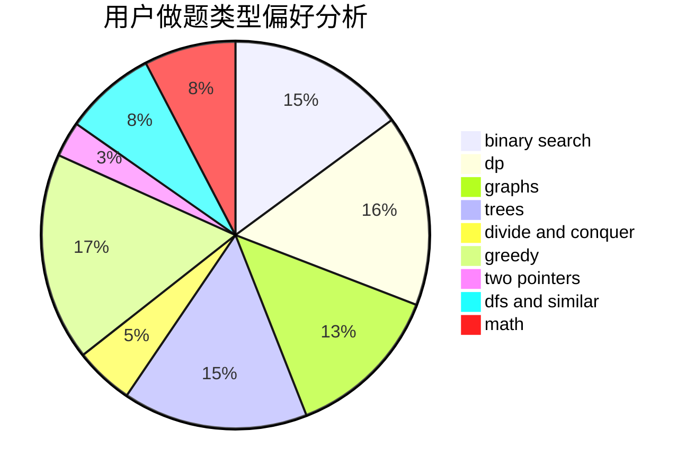

# AyoAyowei

<!-- tabs:start -->

#### **用户提交结果分析**

#### **用户做题类型偏好分析**

<!-- tabs:end -->
# 推荐题目
[304D](https://codeforces.com/contest/304/problem/D)
[1310B](https://codeforces.com/contest/1310/problem/B)
[1307D](https://codeforces.com/contest/1307/problem/D)
[472G](https://codeforces.com/contest/472/problem/G)
[1154D](https://codeforces.com/contest/1154/problem/D)
[1138E](https://codeforces.com/contest/1138/problem/E)
[158E](https://codeforces.com/contest/158/problem/E)
[476C](https://codeforces.com/contest/476/problem/C)
[319A](https://codeforces.com/contest/319/problem/A)
[474B](https://codeforces.com/contest/474/problem/B)
