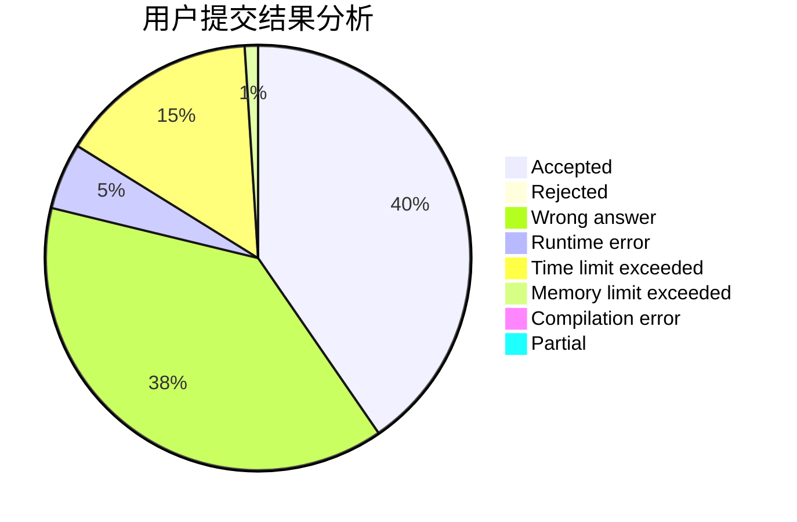
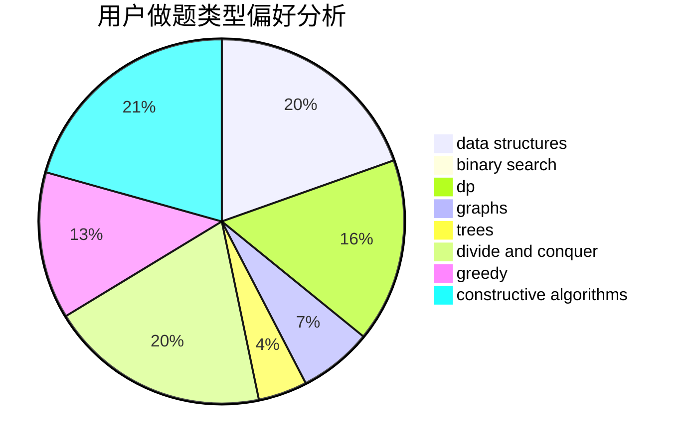

# gmh77

<!-- tabs:start -->

#### **用户提交结果分析**

#### **用户做题类型偏好分析**

#### **用户错题知识点分析**

<!-- tabs:end -->
# 推荐题目
[61A](https://codeforces.com/contest/61/problem/A)		implementation		  
[59A](https://codeforces.com/contest/59/problem/A)		implementation,
                        strings		  
[371C](https://codeforces.com/contest/371/problem/C)		binary search,
                        brute force		  
[190C](https://codeforces.com/contest/190/problem/C)		dfs and similar		  
[716C](https://codeforces.com/contest/716/problem/C)		dsu,graphs,sortings,trees		  
[611E](https://codeforces.com/contest/611/problem/E)		data structures,
                        greedy,
                        sortings		  
[1469C](https://codeforces.com/contest/1469/problem/C)		dp,
                        greedy,
                        implementation,
                        two pointers		  
[1249A](https://codeforces.com/contest/1249/problem/A)		math		  
[1303F](https://codeforces.com/contest/1303/problem/F)		dsu,
                        implementation		  
[1419A](https://codeforces.com/contest/1419/problem/A)		games,
                        greedy,
                        implementation		  
