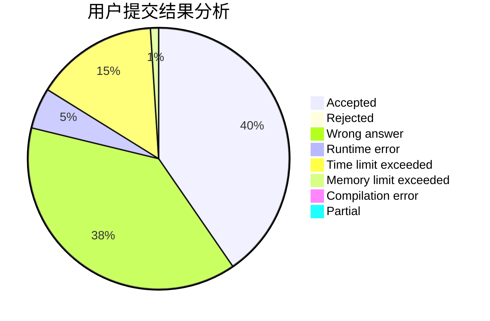
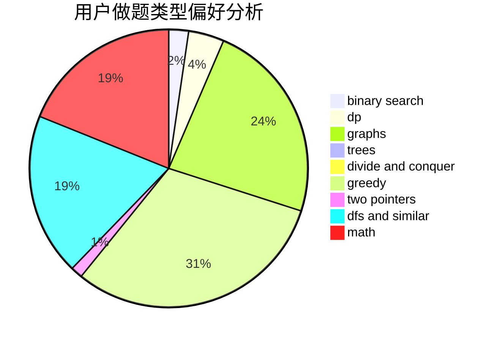

# gmh77

<!-- tabs:start -->

#### **用户提交结果分析**

#### **用户做题类型偏好分析**

<!-- tabs:end -->
# 推荐题目
[63C](https://codeforces.com/contest/63/problem/C)
[618B](https://codeforces.com/contest/618/problem/B)
[400E](https://codeforces.com/contest/400/problem/E)
[215D](https://codeforces.com/contest/215/problem/D)
[734C](https://codeforces.com/contest/734/problem/C)
[630I](https://codeforces.com/contest/630/problem/I)
[1477D](https://codeforces.com/contest/1477/problem/D)
[1252H](https://codeforces.com/contest/1252/problem/H)
[1312D](https://codeforces.com/contest/1312/problem/D)
[1426E](https://codeforces.com/contest/1426/problem/E)
