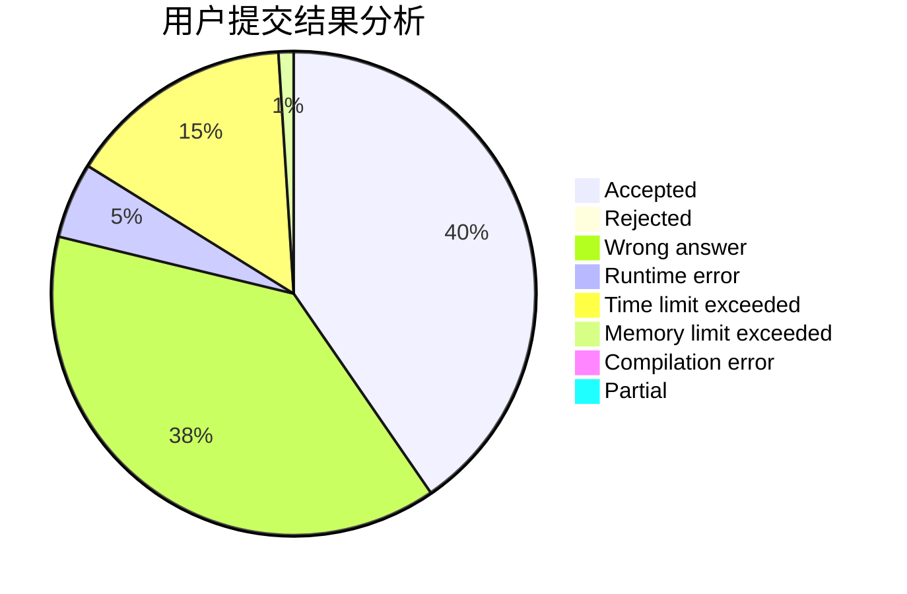
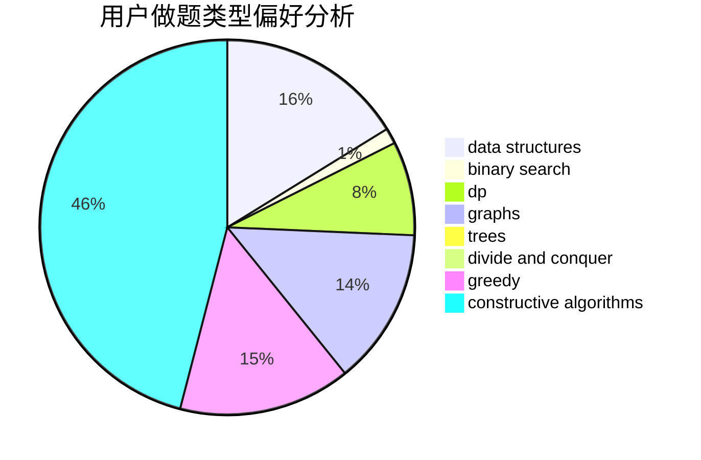

# gmh77

<!-- tabs:start -->

#### **用户提交结果分析**

#### **用户做题类型偏好分析**

#### **用户错题知识点分析**

<!-- tabs:end -->
# 推荐题目
[63C](https://codeforces.com/contest/63/problem/C)		brute force,
                        implementation		  
[618B](https://codeforces.com/contest/618/problem/B)		constructive algorithms		  
[400E](https://codeforces.com/contest/400/problem/E)		binary search,
                        bitmasks,
                        data structures		  
[215D](https://codeforces.com/contest/215/problem/D)		greedy		  
[734C](https://codeforces.com/contest/734/problem/C)		binary search,
                        dp,
                        greedy,
                        two pointers		  
[630I](https://codeforces.com/contest/630/problem/I)		combinatorics,
                        math		  
[1477D](https://codeforces.com/contest/1477/problem/D)		constructive algorithms,
                        dfs and similar,
                        graphs		  
[1252H](https://codeforces.com/contest/1252/problem/H)		greedy,
                        implementation		  
[1312D](https://codeforces.com/contest/1312/problem/D)		combinatorics,
                        math		  
[1426E](https://codeforces.com/contest/1426/problem/E)		brute force,
                        constructive algorithms,
                        flows,
                        greedy,
                        math		  
