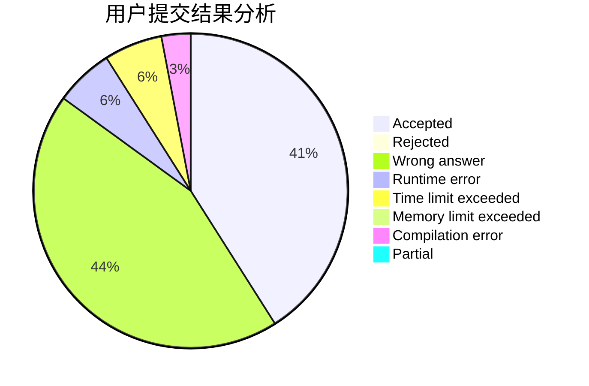
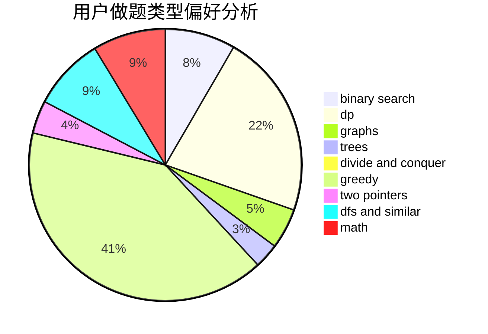

# gmr

<!-- tabs:start -->

#### **用户提交结果分析**

#### **用户做题类型偏好分析**

<!-- tabs:end -->
# 推荐题目
[9A](https://codeforces.com/contest/9/problem/A)
[883D](https://codeforces.com/contest/883/problem/D)
[1380F](https://codeforces.com/contest/1380/problem/F)
[746E](https://codeforces.com/contest/746/problem/E)
[94C](https://codeforces.com/contest/94/problem/C)
[732A](https://codeforces.com/contest/732/problem/A)
[852I](https://codeforces.com/contest/852/problem/I)
[297C](https://codeforces.com/contest/297/problem/C)
[887D](https://codeforces.com/contest/887/problem/D)
[166C](https://codeforces.com/contest/166/problem/C)
