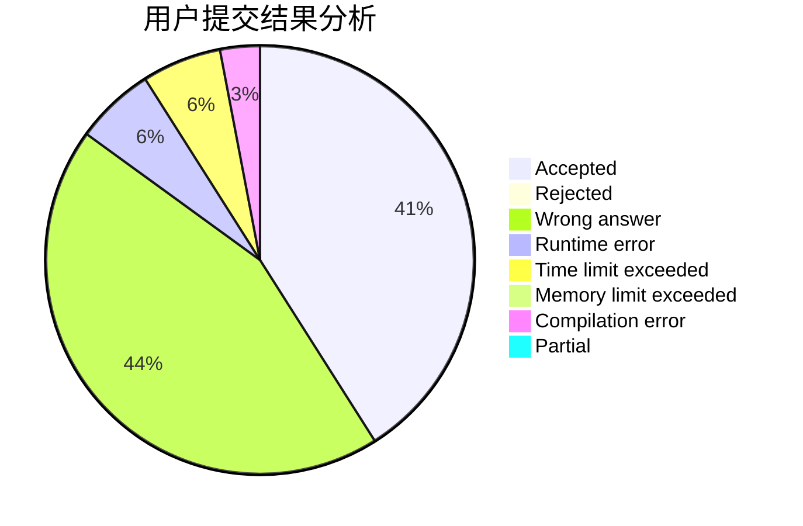
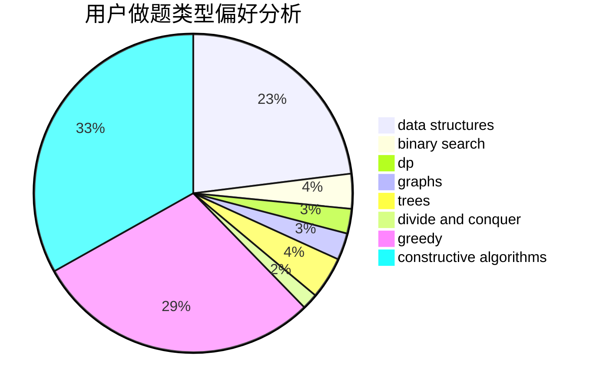
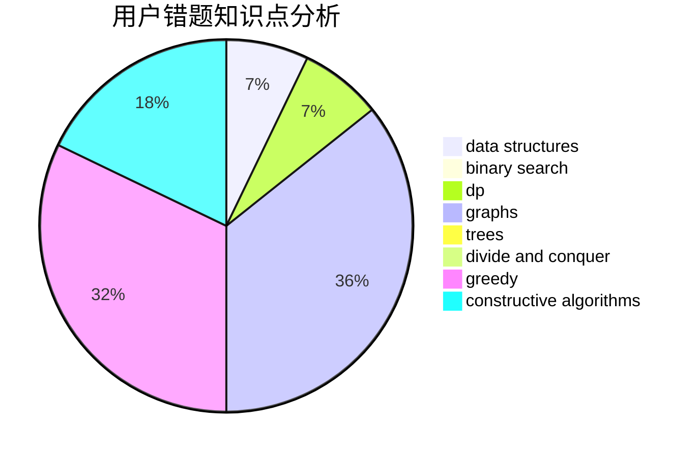

# gmr

<!-- tabs:start -->

#### **用户提交结果分析**

#### **用户做题类型偏好分析**

#### **用户错题知识点分析**

<!-- tabs:end -->
# 推荐题目
[985A](https://codeforces.com/contest/985/problem/A)		implementation		  
[863B](https://codeforces.com/contest/863/problem/B)		brute force,
                        greedy,
                        sortings		  
[1372A](https://codeforces.com/contest/1372/problem/A)		constructive algorithms,
                        implementation		  
[729E](https://codeforces.com/contest/729/problem/E)		constructive algorithms,
                        data structures,
                        graphs,
                        greedy,
                        sortings		  
[930A](https://codeforces.com/contest/930/problem/A)		dfs and similar,
                        graphs,
                        trees		  
[712E](https://codeforces.com/contest/712/problem/E)		data structures,
                        math,
                        probabilities		  
[835B](https://codeforces.com/contest/835/problem/B)		greedy		  
[281A](https://codeforces.com/contest/281/problem/A)		implementation,
                        strings		  
[868B](https://codeforces.com/contest/868/problem/B)		implementation		  
[1510J](https://codeforces.com/contest/1510/problem/J)		constructive algorithms,
                        math		  
