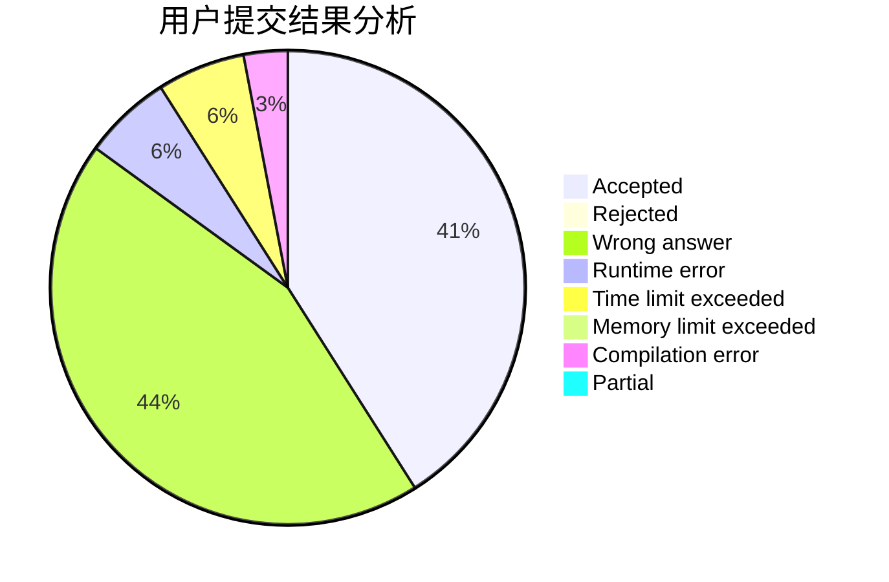
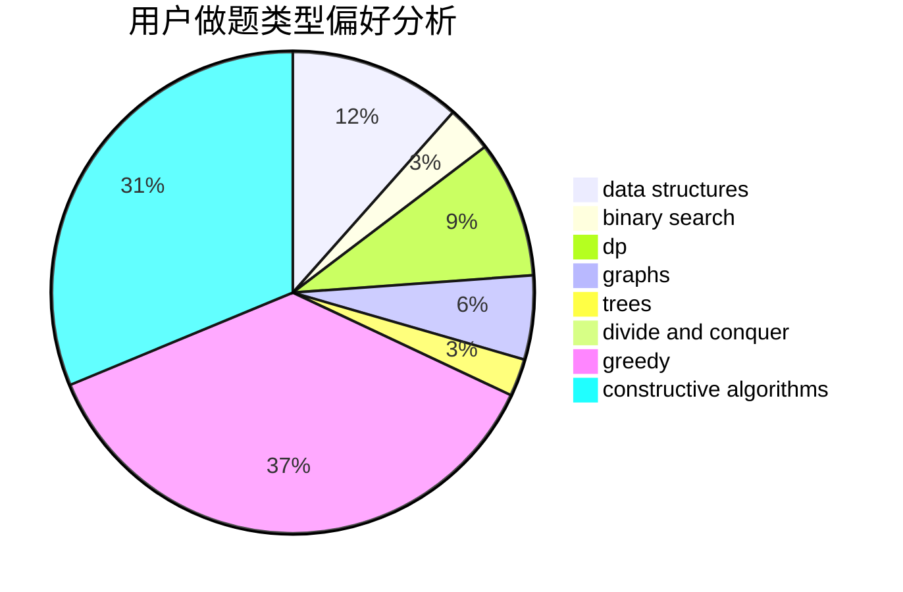
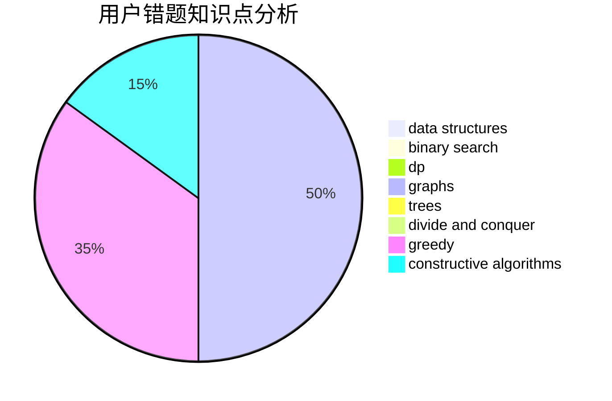

# gmr

<!-- tabs:start -->

#### **用户提交结果分析**

#### **用户做题类型偏好分析**

#### **用户错题知识点分析**

<!-- tabs:end -->
# 推荐题目
[9A](https://codeforces.com/contest/9/problem/A)		math,
                        probabilities		  
[883D](https://codeforces.com/contest/883/problem/D)		binary search,
                        dp,
                        math		  
[1380F](https://codeforces.com/contest/1380/problem/F)		data structures,
                        dp,
                        matrices		  
[746E](https://codeforces.com/contest/746/problem/E)		greedy,
                        implementation,
                        math		  
[94C](https://codeforces.com/contest/94/problem/C)		dsu,graphs,sortings,trees		  
[732A](https://codeforces.com/contest/732/problem/A)		brute force,
                        constructive algorithms,
                        implementation,
                        math		  
[852I](https://codeforces.com/contest/852/problem/I)		brute force,
                        dfs and similar,
                        graphs,
                        trees		  
[297C](https://codeforces.com/contest/297/problem/C)		constructive algorithms		  
[887D](https://codeforces.com/contest/887/problem/D)		data structures,
                        two pointers		  
[166C](https://codeforces.com/contest/166/problem/C)		greedy,
                        math,
                        sortings		  
