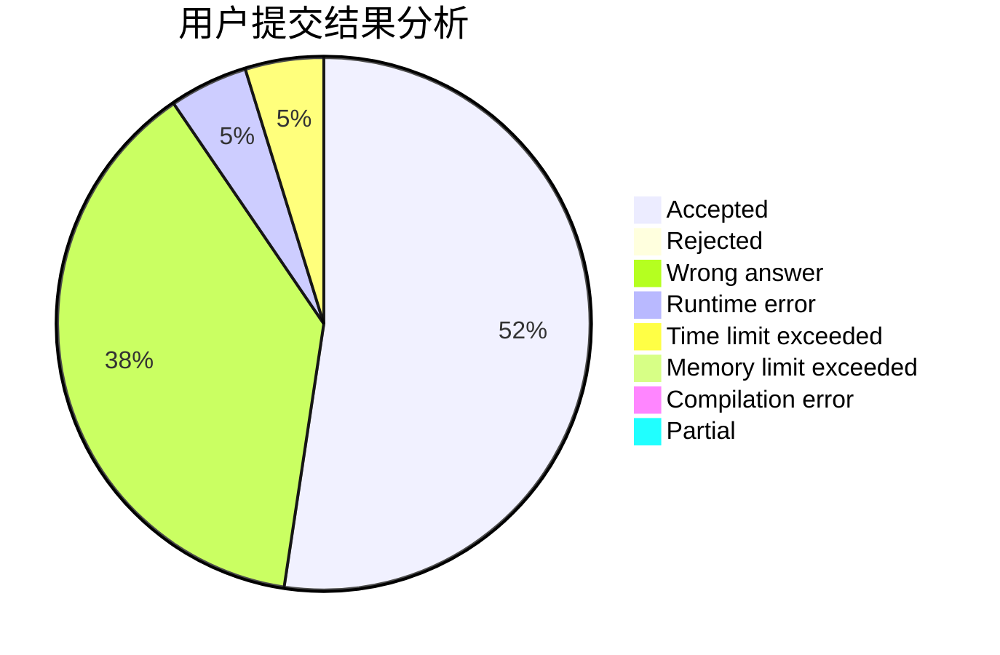
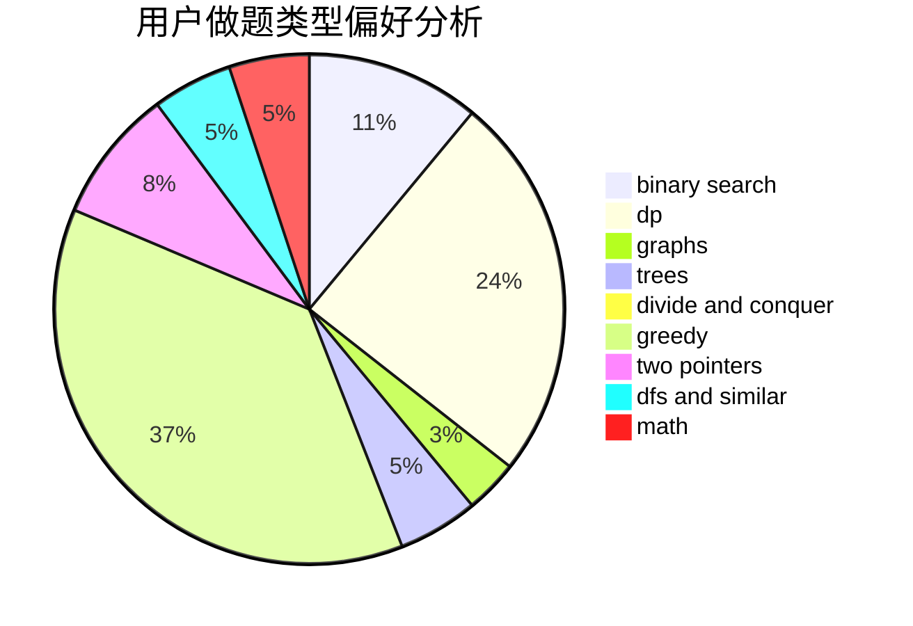

# gnocuil

<!-- tabs:start -->

#### **用户提交结果分析**

#### **用户做题类型偏好分析**

<!-- tabs:end -->
# 推荐题目
[741E](https://codeforces.com/contest/741/problem/E)
[1108A](https://codeforces.com/contest/1108/problem/A)
[710B](https://codeforces.com/contest/710/problem/B)
[981G](https://codeforces.com/contest/981/problem/G)
[448D](https://codeforces.com/contest/448/problem/D)
[861A](https://codeforces.com/contest/861/problem/A)
[1413D](https://codeforces.com/contest/1413/problem/D)
[1109D](https://codeforces.com/contest/1109/problem/D)
[1281E](https://codeforces.com/contest/1281/problem/E)
[599D](https://codeforces.com/contest/599/problem/D)
