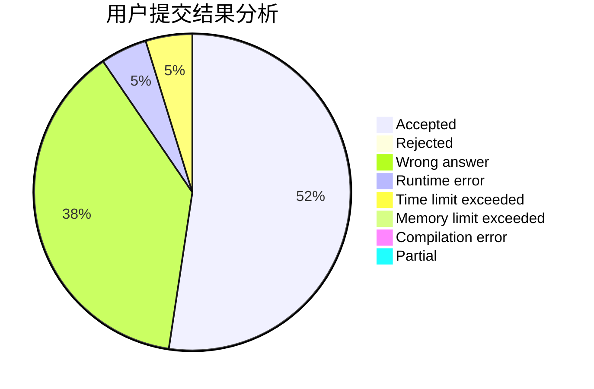
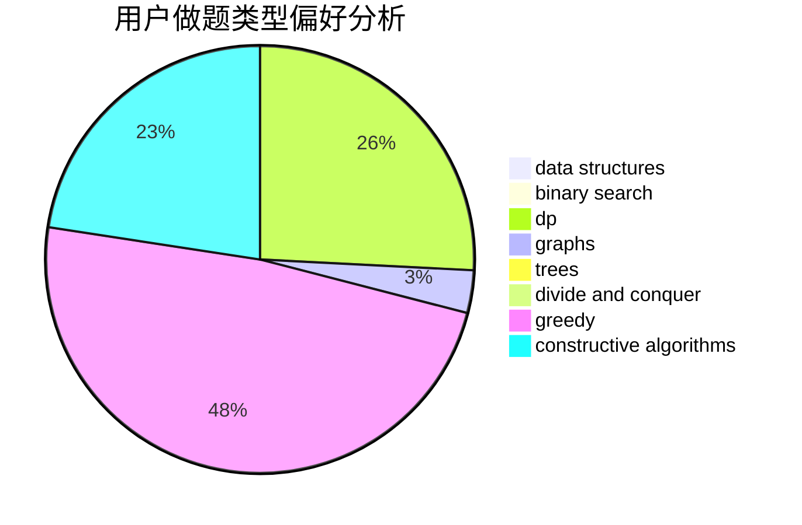
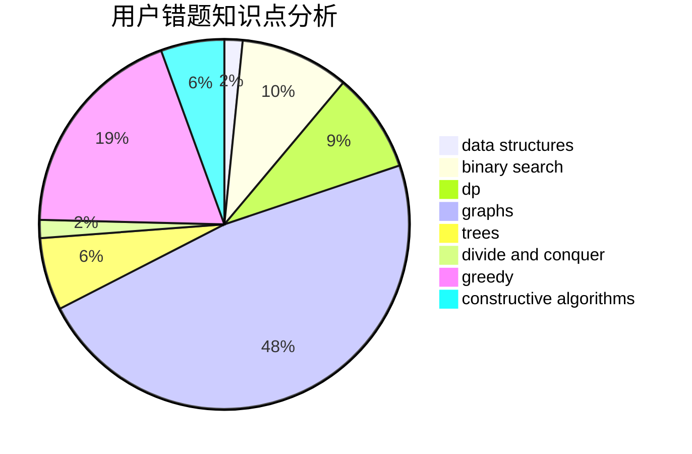

# gnocuil

<!-- tabs:start -->

#### **用户提交结果分析**

#### **用户做题类型偏好分析**

#### **用户错题知识点分析**

<!-- tabs:end -->
# 推荐题目
[724E](https://codeforces.com/contest/724/problem/E)		dp,
                        flows,
                        greedy		  
[1107F](https://codeforces.com/contest/1107/problem/F)		dp,
                        flows,
                        graph matchings,
                        graphs,
                        sortings		  
[690A1](https://codeforces.com/contest/690A/problem/1)		nan		  
[95E](https://codeforces.com/contest/95/problem/E)		dp,
                        dsu,
                        graphs		  
[425B](https://codeforces.com/contest/425/problem/B)		bitmasks,
                        greedy		  
[842B](https://codeforces.com/contest/842/problem/B)		geometry		  
[1402B](https://codeforces.com/contest/1402/problem/B)		*special problem,
                        geometry,
                        sortings		  
[1108F](https://codeforces.com/contest/1108/problem/F)		binary search,
                        dsu,
                        graphs,
                        greedy		  
[1272C](https://codeforces.com/contest/1272/problem/C)		combinatorics,
                        dp,
                        implementation		  
[578B](https://codeforces.com/contest/578/problem/B)		brute force,
                        greedy		  
