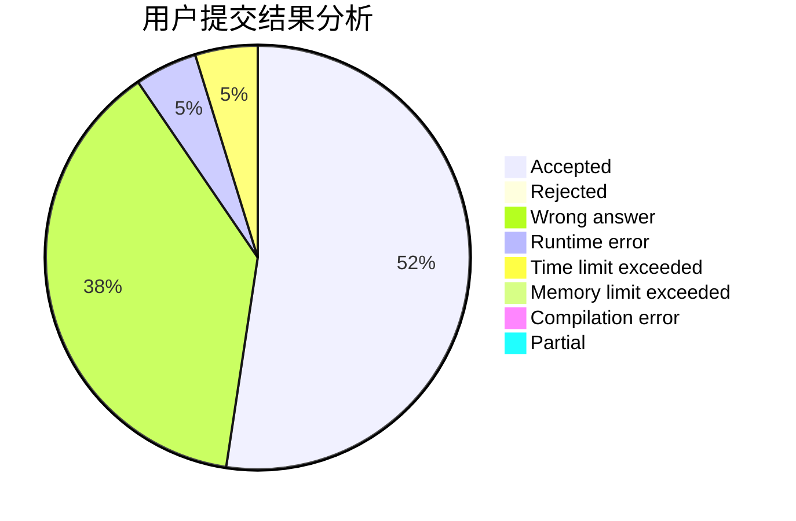
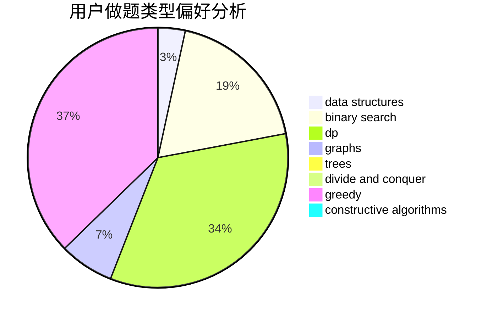
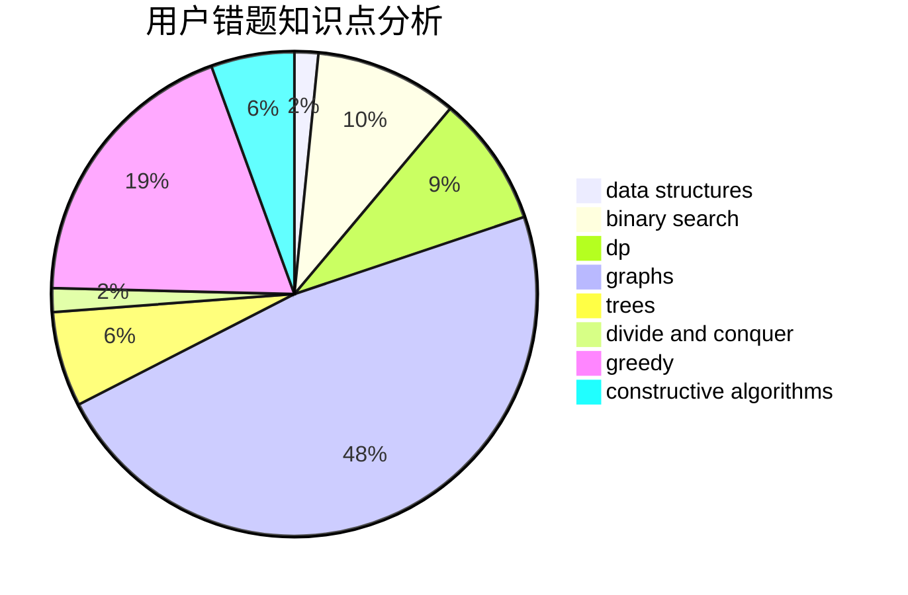

# gnocuil

<!-- tabs:start -->

#### **用户提交结果分析**

#### **用户做题类型偏好分析**

#### **用户错题知识点分析**

<!-- tabs:end -->
# 推荐题目
[741E](https://codeforces.com/contest/741/problem/E)		data structures,
                        string suffix structures		  
[1108A](https://codeforces.com/contest/1108/problem/A)		implementation		  
[710B](https://codeforces.com/contest/710/problem/B)		brute force,
                        sortings		  
[981G](https://codeforces.com/contest/981/problem/G)		data structures		  
[448D](https://codeforces.com/contest/448/problem/D)		binary search,
                        brute force		  
[861A](https://codeforces.com/contest/861/problem/A)		dsu,graphs,sortings,trees		  
[1413D](https://codeforces.com/contest/1413/problem/D)		data structures,
                        greedy,
                        implementation		  
[1109D](https://codeforces.com/contest/1109/problem/D)		brute force,
                        combinatorics,
                        dp,
                        math,
                        trees		  
[1281E](https://codeforces.com/contest/1281/problem/E)		dsu,graphs,sortings,trees		  
[599D](https://codeforces.com/contest/599/problem/D)		brute force,
                        math		  
