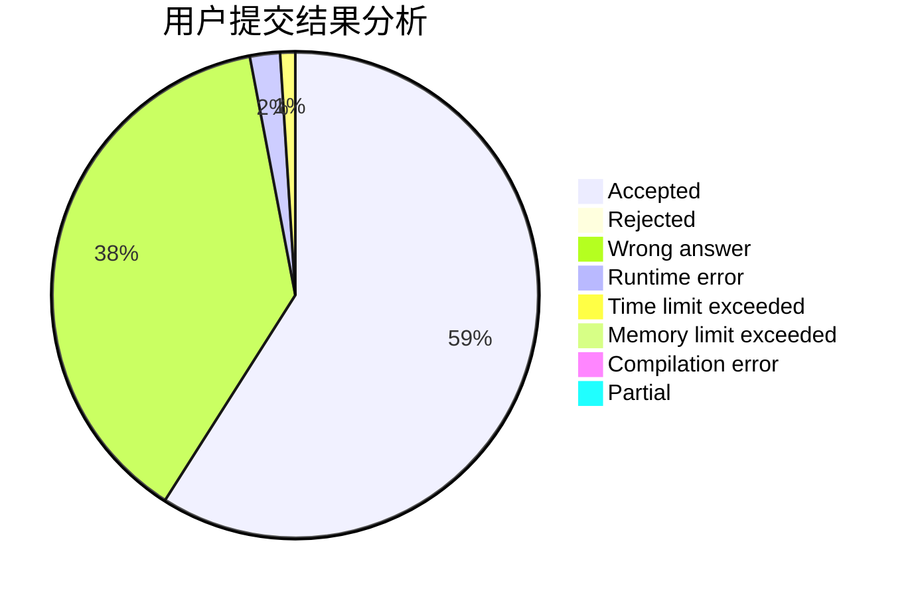
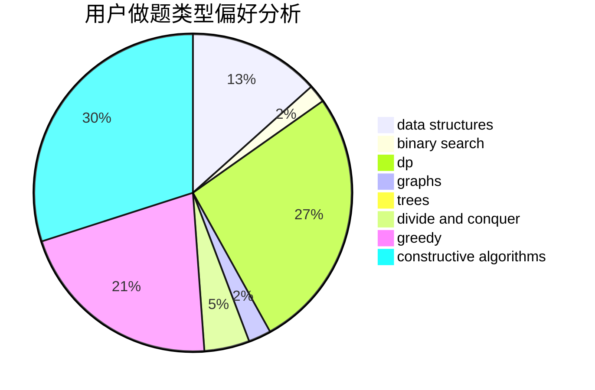
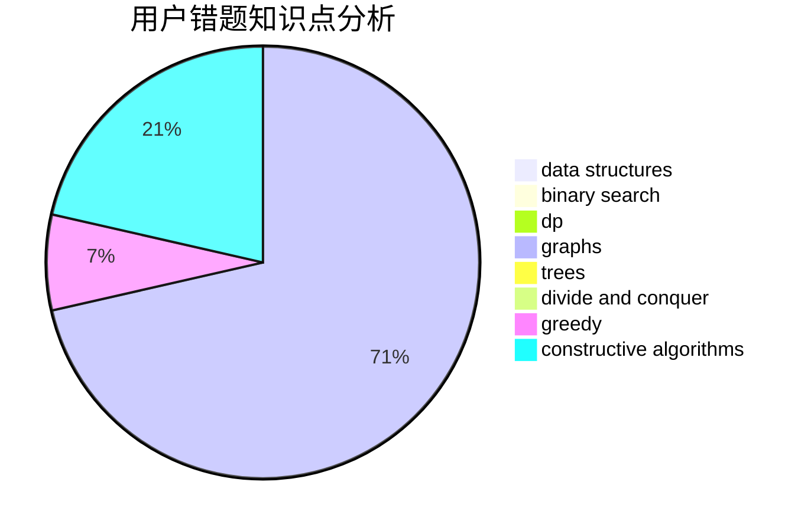

# gnosis

<!-- tabs:start -->

#### **用户提交结果分析**

#### **用户做题类型偏好分析**

#### **用户错题知识点分析**

<!-- tabs:end -->
# 推荐题目
[286A](https://codeforces.com/contest/286/problem/A)		constructive algorithms,
                        math		  
[1070C](https://codeforces.com/contest/1070/problem/C)		data structures,
                        greedy		  
[108C](https://codeforces.com/contest/108/problem/C)		dsu,graphs,sortings,trees		  
[29B](https://codeforces.com/contest/29/problem/B)		implementation		  
[1216D](https://codeforces.com/contest/1216/problem/D)		math		  
[497A](https://codeforces.com/contest/497/problem/A)		dsu,graphs,sortings,trees		  
[1492D](https://codeforces.com/contest/1492/problem/D)		bitmasks,
                        constructive algorithms,
                        greedy,
                        math		  
[952B](https://codeforces.com/contest/952/problem/B)		brute force,
                        interactive		  
[71B](https://codeforces.com/contest/71/problem/B)		implementation,
                        math		  
[1357D5](https://codeforces.com/contest/1357D/problem/5)		nan		  
