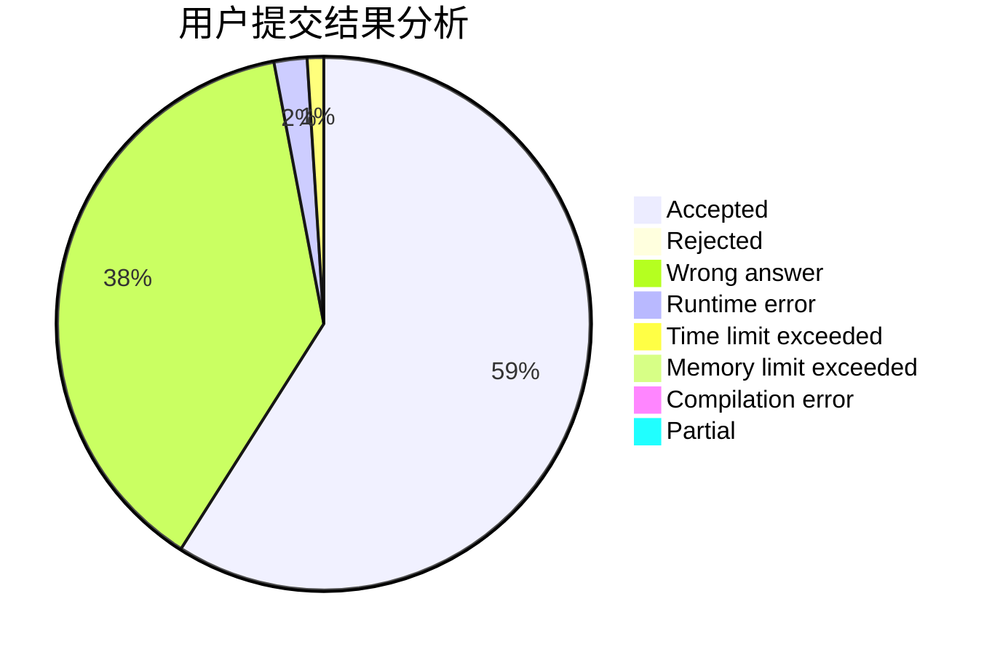
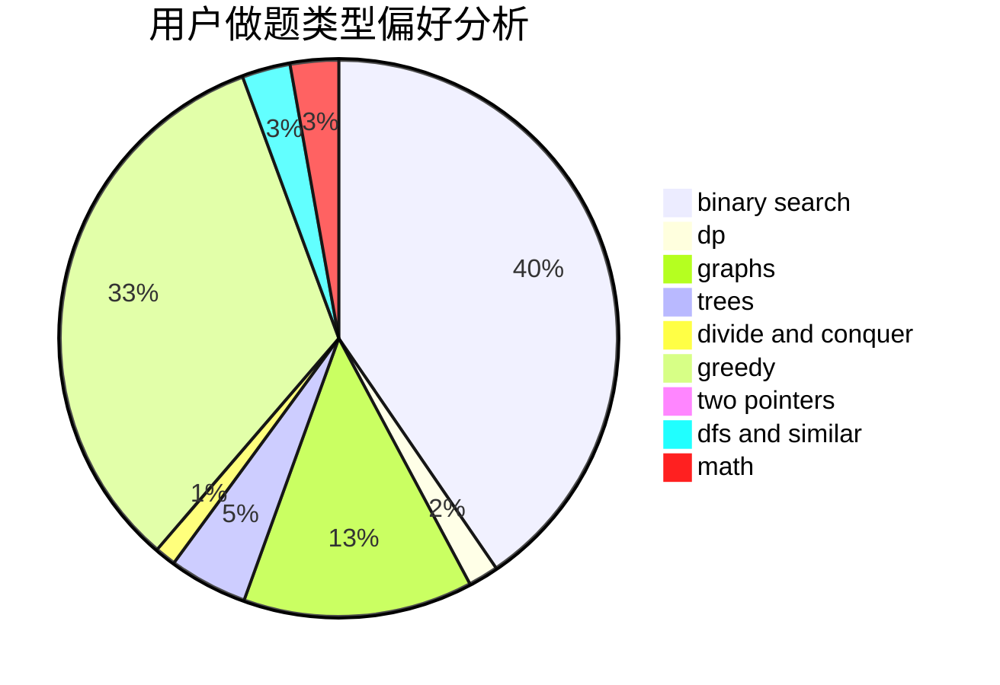

# gnosis

<!-- tabs:start -->

#### **用户提交结果分析**

#### **用户做题类型偏好分析**

<!-- tabs:end -->
# 推荐题目
[300B](https://codeforces.com/contest/300/problem/B)
[1070F](https://codeforces.com/contest/1070/problem/F)
[1090D](https://codeforces.com/contest/1090/problem/D)
[317A](https://codeforces.com/contest/317/problem/A)
[1223A](https://codeforces.com/contest/1223/problem/A)
[516B](https://codeforces.com/contest/516/problem/B)
[1500E](https://codeforces.com/contest/1500/problem/E)
[975A](https://codeforces.com/contest/975/problem/A)
[737B](https://codeforces.com/contest/737/problem/B)
[1365G](https://codeforces.com/contest/1365/problem/G)
