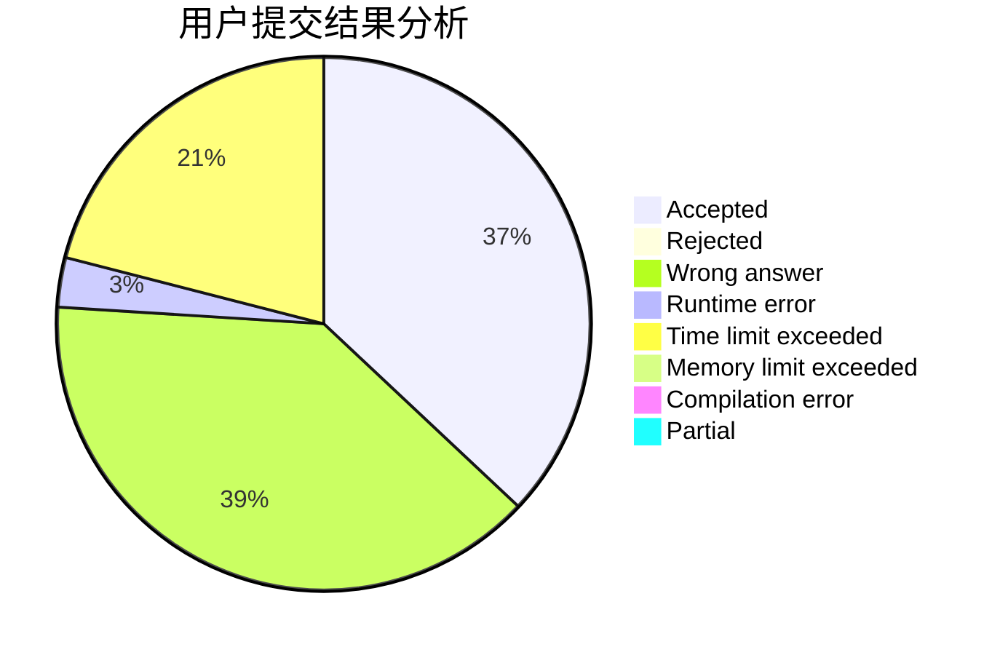
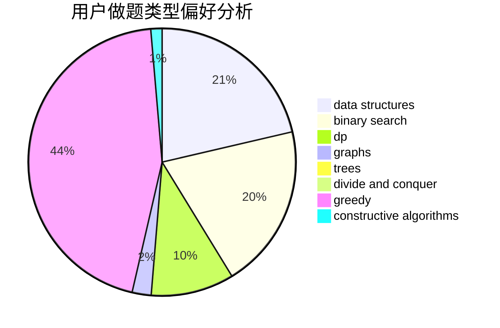
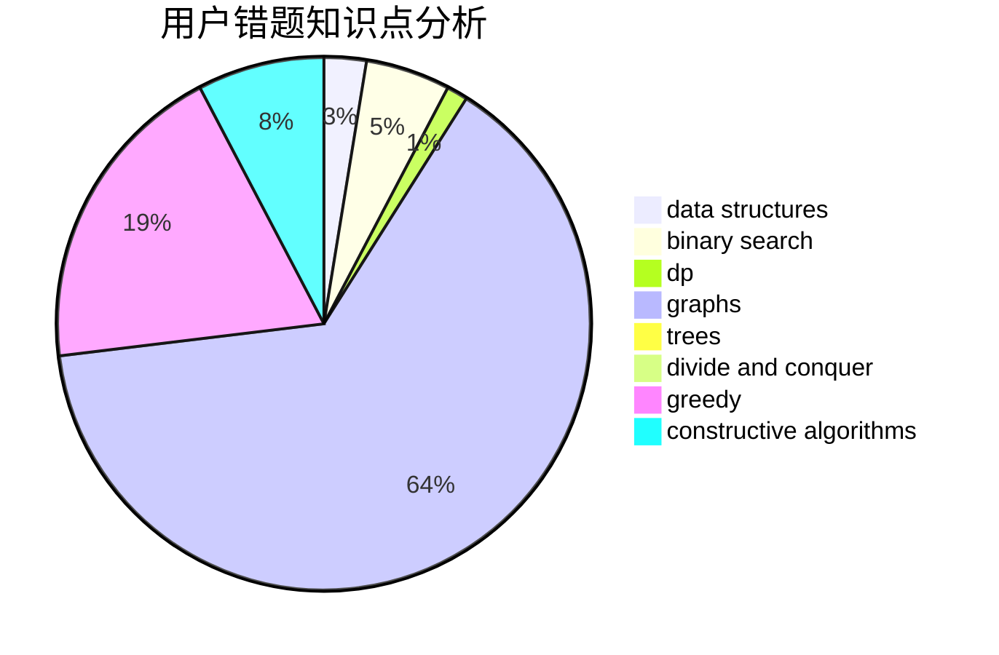

# goatzyq

<!-- tabs:start -->

#### **用户提交结果分析**

#### **用户做题类型偏好分析**

#### **用户错题知识点分析**

<!-- tabs:end -->
# 推荐题目
[1491C](https://codeforces.com/contest/1491/problem/C)		brute force,
                        data structures,
                        dp,
                        greedy,
                        implementation		  
[1474A](https://codeforces.com/contest/1474/problem/A)		greedy		  
[1494C](https://codeforces.com/contest/1494/problem/C)		binary search,
                        dp,
                        greedy,
                        implementation,
                        two pointers		  
[301A](https://codeforces.com/contest/301/problem/A)		constructive algorithms		  
[74B](https://codeforces.com/contest/74/problem/B)		dp,
                        games,
                        greedy		  
[825E](https://codeforces.com/contest/825/problem/E)		data structures,
                        dfs and similar,
                        graphs,
                        greedy		  
[80A](https://codeforces.com/contest/80/problem/A)		brute force		  
[251C](https://codeforces.com/contest/251/problem/C)		dp,
                        greedy,
                        number theory		  
[13351](https://codeforces.com/contest/1335/problem/1)		dsu,graphs,sortings,trees		  
[916B](https://codeforces.com/contest/916/problem/B)		bitmasks,
                        greedy,
                        math		  
