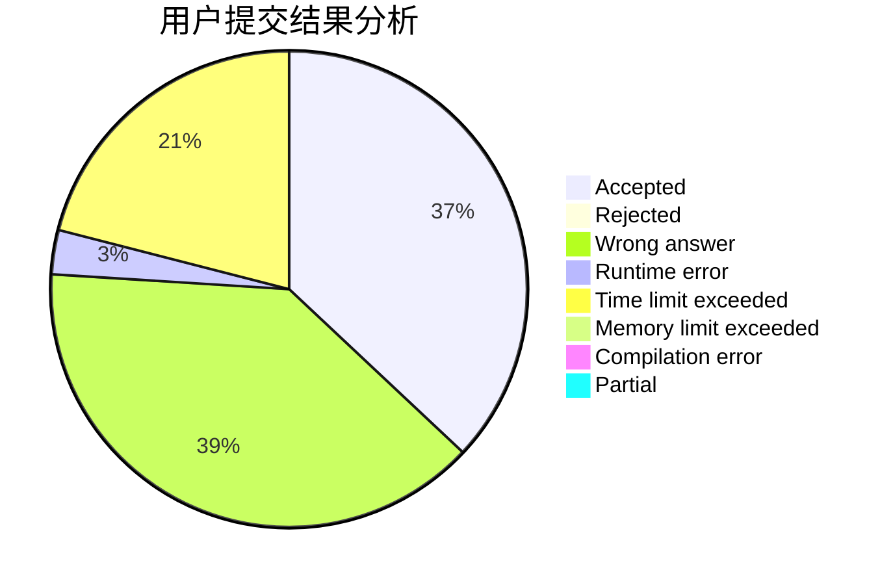
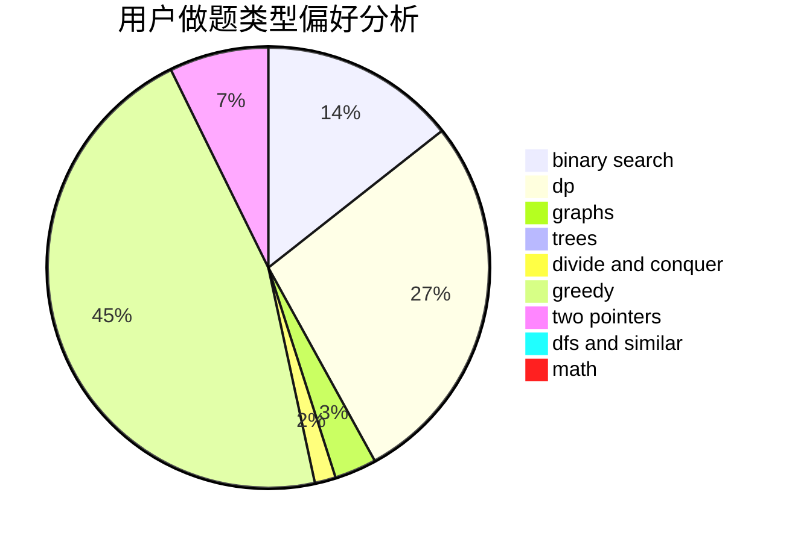

# goatzyq

<!-- tabs:start -->

#### **用户提交结果分析**

#### **用户做题类型偏好分析**

<!-- tabs:end -->
# 推荐题目
[1491C](https://codeforces.com/contest/1491/problem/C)
[1474A](https://codeforces.com/contest/1474/problem/A)
[1494C](https://codeforces.com/contest/1494/problem/C)
[301A](https://codeforces.com/contest/301/problem/A)
[74B](https://codeforces.com/contest/74/problem/B)
[825E](https://codeforces.com/contest/825/problem/E)
[80A](https://codeforces.com/contest/80/problem/A)
[251C](https://codeforces.com/contest/251/problem/C)
[13351](https://codeforces.com/contest/1335/problem/1)
[916B](https://codeforces.com/contest/916/problem/B)
