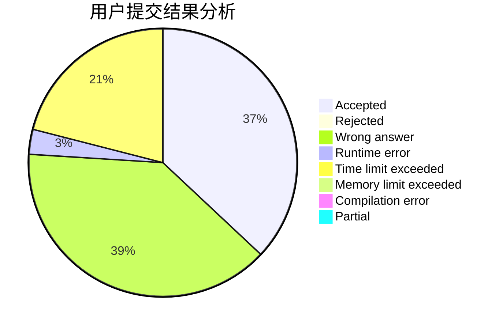
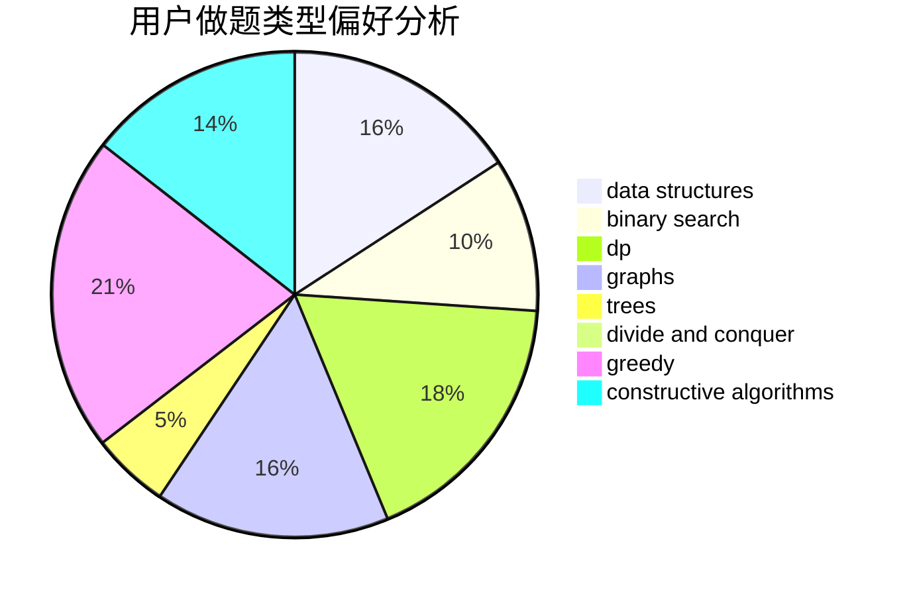
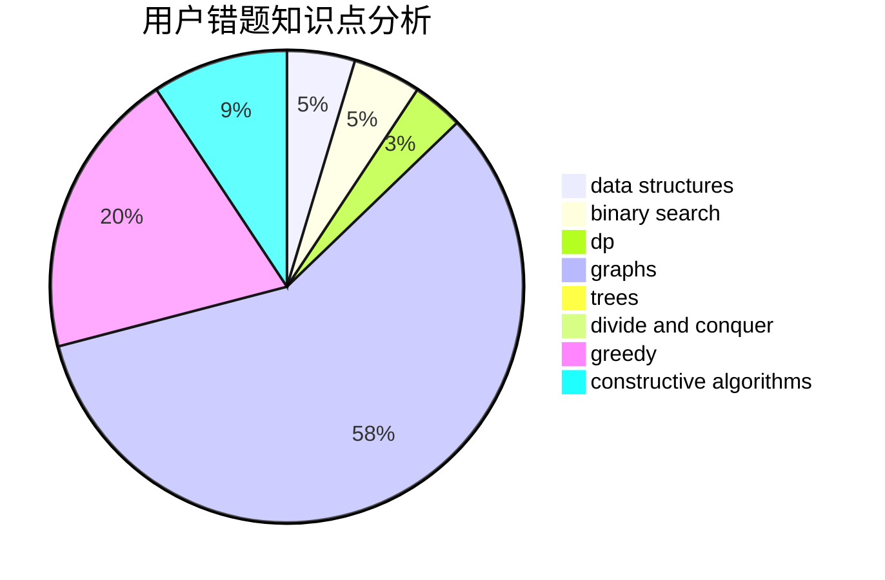

# goatzyq

<!-- tabs:start -->

#### **用户提交结果分析**

#### **用户做题类型偏好分析**

#### **用户错题知识点分析**

<!-- tabs:end -->
# 推荐题目
[1483E](https://codeforces.com/contest/1483/problem/E)		dsu,graphs,sortings,trees		  
[1466H](https://codeforces.com/contest/1466/problem/H)		combinatorics,
                        dp,
                        graphs,
                        greedy,
                        math		  
[1486F](https://codeforces.com/contest/1486/problem/F)		combinatorics,
                        data structures,
                        dfs and similar,
                        dp,
                        trees		  
[286E](https://codeforces.com/contest/286/problem/E)		constructive algorithms,
                        fft,
                        math		  
[732A](https://codeforces.com/contest/732/problem/A)		brute force,
                        constructive algorithms,
                        implementation,
                        math		  
[808F](https://codeforces.com/contest/808/problem/F)		binary search,
                        flows,
                        graphs		  
[794G](https://codeforces.com/contest/794/problem/G)		combinatorics,
                        dp,
                        math		  
[230B](https://codeforces.com/contest/230/problem/B)		binary search,
                        implementation,
                        math,
                        number theory		  
[1328E](https://codeforces.com/contest/1328/problem/E)		dfs and similar,
                        graphs,
                        trees		  
[8D](https://codeforces.com/contest/8/problem/D)		binary search,
                        geometry		  
