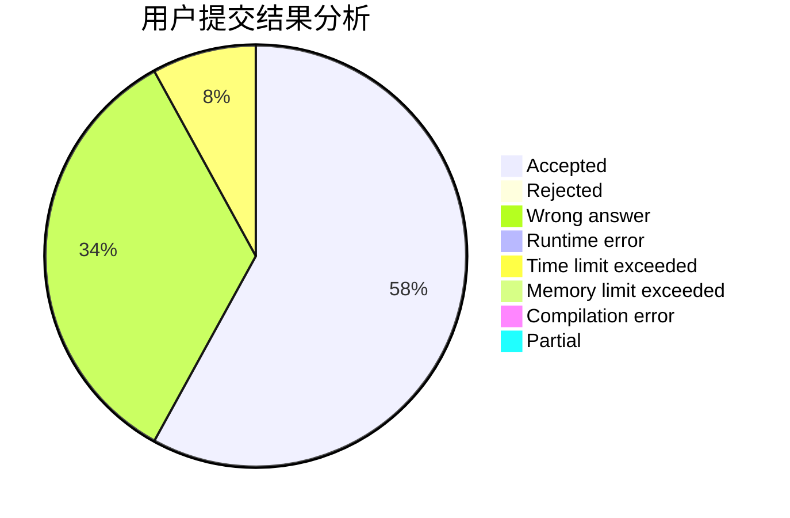
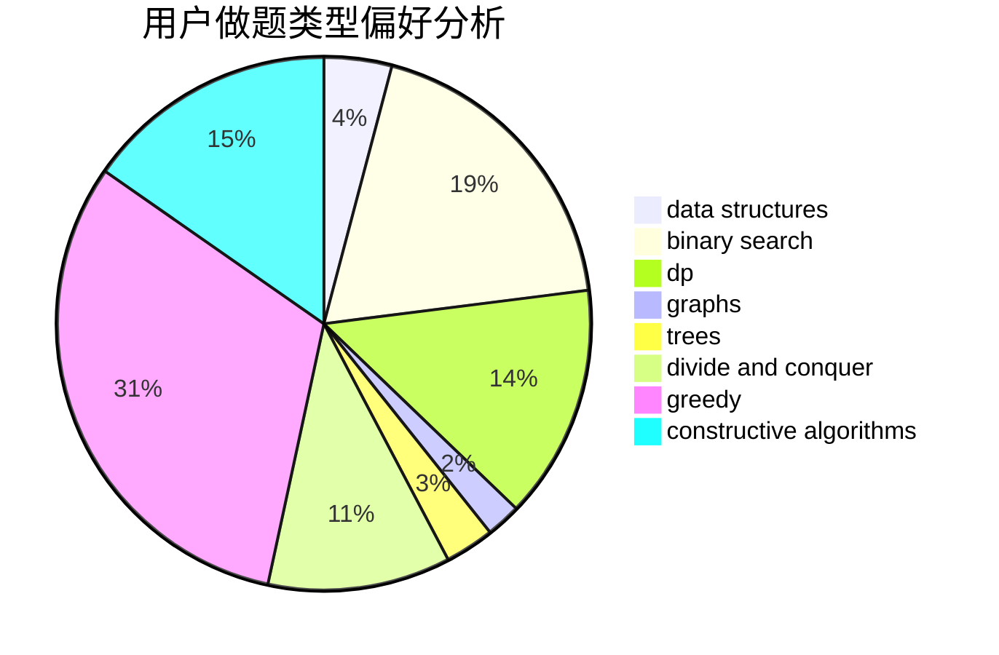

# gongxi

<!-- tabs:start -->

#### **用户提交结果分析**

#### **用户做题类型偏好分析**

#### **用户错题知识点分析**

<!-- tabs:end -->
# 推荐题目
[448B](https://codeforces.com/contest/448/problem/B)		implementation,
                        strings		  
[978E](https://codeforces.com/contest/978/problem/E)		combinatorics,
                        math		  
[1033G](https://codeforces.com/contest/1033/problem/G)		games		  
[1367C](https://codeforces.com/contest/1367/problem/C)		constructive algorithms,
                        greedy,
                        math		  
[870C](https://codeforces.com/contest/870/problem/C)		dp,
                        greedy,
                        math,
                        number theory		  
[1101D](https://codeforces.com/contest/1101/problem/D)		data structures,
                        dfs and similar,
                        dp,
                        number theory,
                        trees		  
[886F](https://codeforces.com/contest/886/problem/F)		geometry		  
[671E](https://codeforces.com/contest/671/problem/E)		data structures,
                        greedy		  
[53D](https://codeforces.com/contest/53/problem/D)		sortings		  
[293B](https://codeforces.com/contest/293/problem/B)		brute force,
                        combinatorics		  
