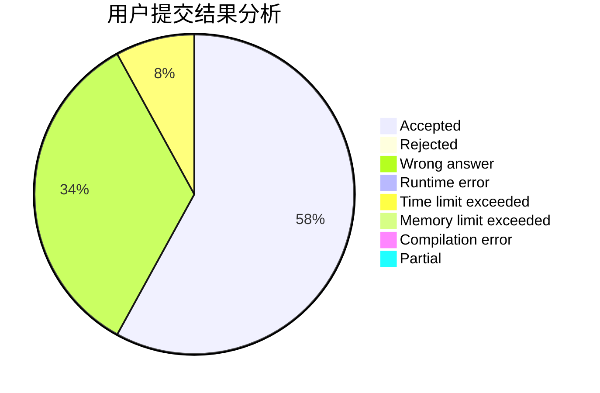
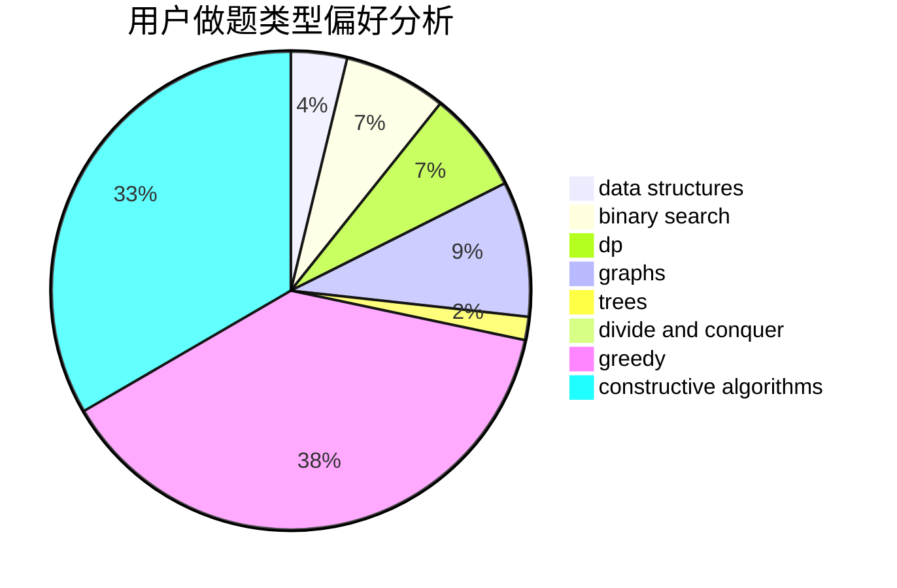

# gongxi

<!-- tabs:start -->

#### **用户提交结果分析**

#### **用户做题类型偏好分析**

#### **用户错题知识点分析**

<!-- tabs:end -->
# 推荐题目
[424E](https://codeforces.com/contest/424/problem/E)		dfs and similar,
                        dp,
                        probabilities		  
[957B](https://codeforces.com/contest/957/problem/B)		dsu,graphs,sortings,trees		  
[1033D](https://codeforces.com/contest/1033/problem/D)		interactive,
                        math,
                        number theory		  
[1359D](https://codeforces.com/contest/1359/problem/D)		data structures,
                        dp,
                        implementation,
                        two pointers		  
[852D](https://codeforces.com/contest/852/problem/D)		binary search,
                        flows,
                        graph matchings,
                        shortest paths		  
[1101A](https://codeforces.com/contest/1101/problem/A)		math		  
[866D](https://codeforces.com/contest/866/problem/D)		dsu,graphs,sortings,trees		  
[645D](https://codeforces.com/contest/645/problem/D)		binary search,
                        dp,
                        graphs		  
[513G1](https://codeforces.com/contest/513G/problem/1)		brute force,
                        dfs and similar,
                        dp,
                        meet-in-the-middle		  
[278B](https://codeforces.com/contest/278/problem/B)		brute force,
                        strings		  
