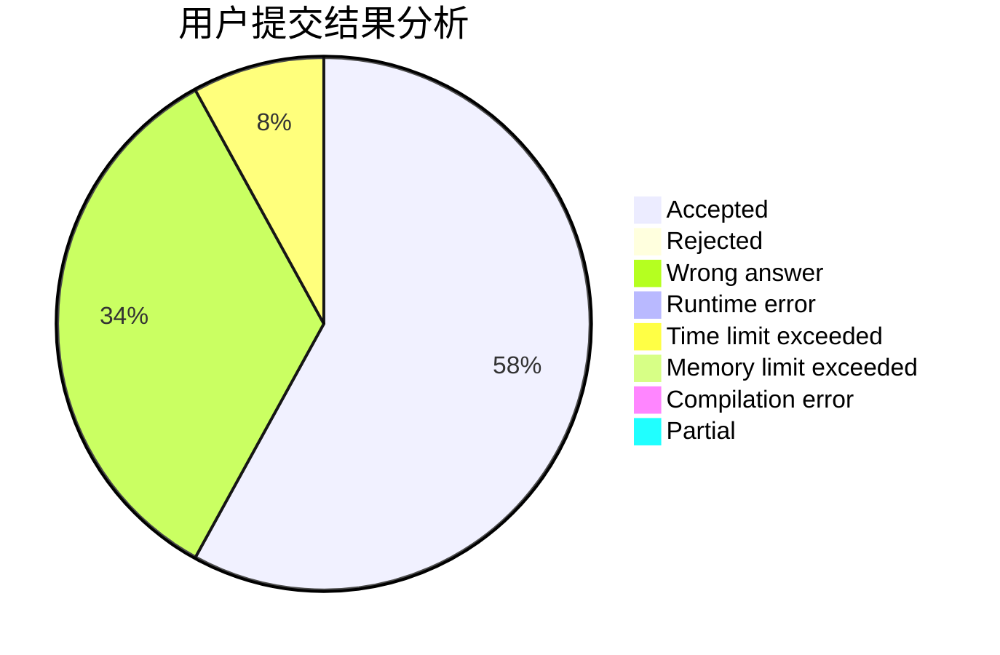
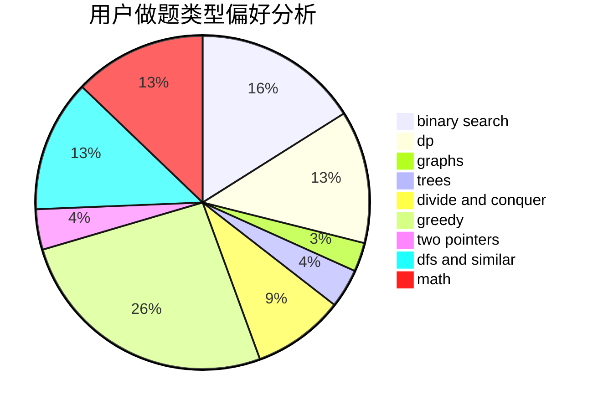

# gongxi

<!-- tabs:start -->

#### **用户提交结果分析**

#### **用户做题类型偏好分析**

<!-- tabs:end -->
# 推荐题目
[448B](https://codeforces.com/contest/448/problem/B)
[978E](https://codeforces.com/contest/978/problem/E)
[1033G](https://codeforces.com/contest/1033/problem/G)
[1367C](https://codeforces.com/contest/1367/problem/C)
[870C](https://codeforces.com/contest/870/problem/C)
[1101D](https://codeforces.com/contest/1101/problem/D)
[886F](https://codeforces.com/contest/886/problem/F)
[671E](https://codeforces.com/contest/671/problem/E)
[53D](https://codeforces.com/contest/53/problem/D)
[293B](https://codeforces.com/contest/293/problem/B)
