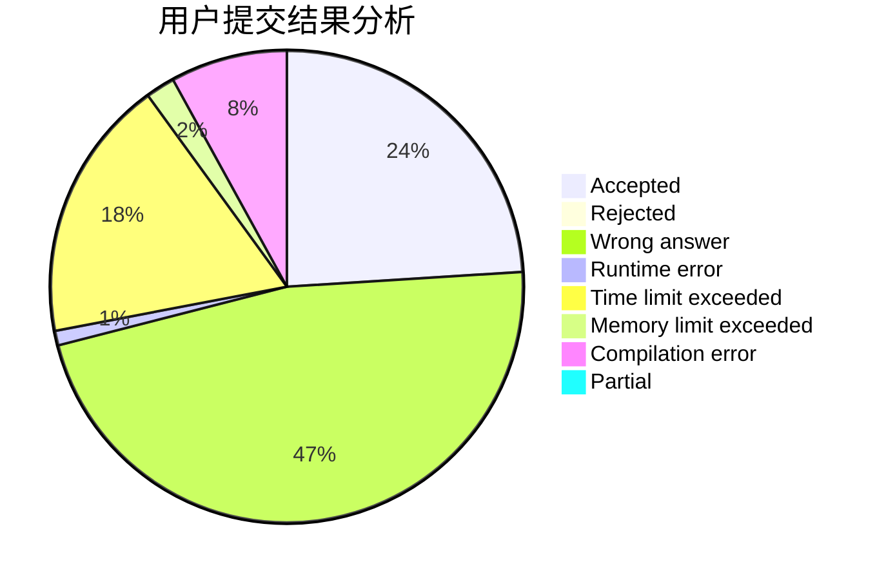
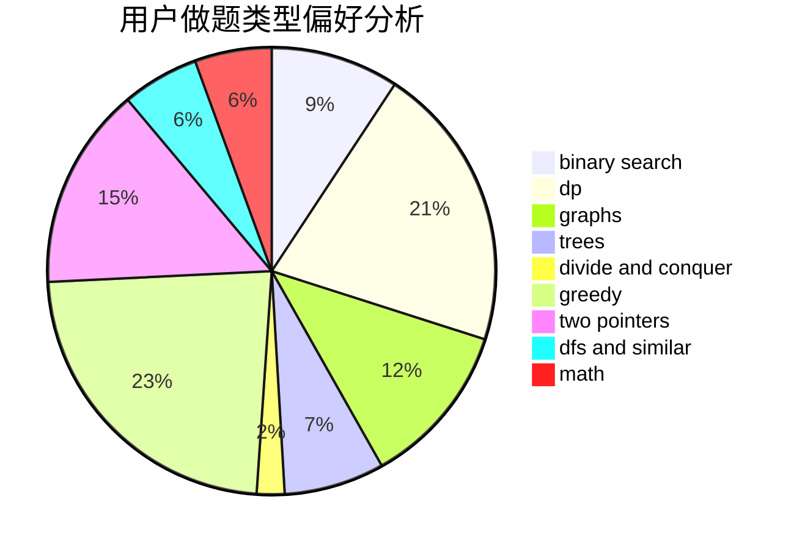

# grandahundo

<!-- tabs:start -->

#### **用户提交结果分析**

#### **用户做题类型偏好分析**

<!-- tabs:end -->
# 推荐题目
[567A](https://codeforces.com/contest/567/problem/A)
[598E](https://codeforces.com/contest/598/problem/E)
[825E](https://codeforces.com/contest/825/problem/E)
[1023C](https://codeforces.com/contest/1023/problem/C)
[776D](https://codeforces.com/contest/776/problem/D)
[519B](https://codeforces.com/contest/519/problem/B)
[899C](https://codeforces.com/contest/899/problem/C)
[812A](https://codeforces.com/contest/812/problem/A)
[1103B](https://codeforces.com/contest/1103/problem/B)
[183D](https://codeforces.com/contest/183/problem/D)
