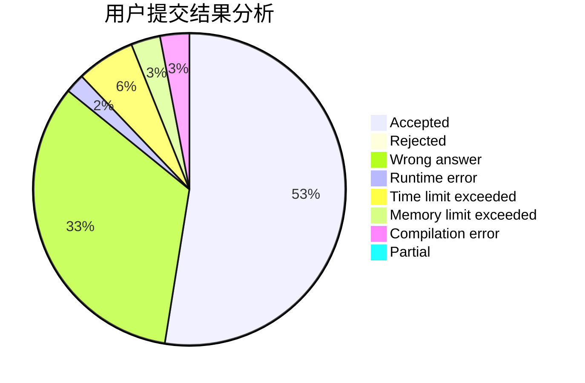
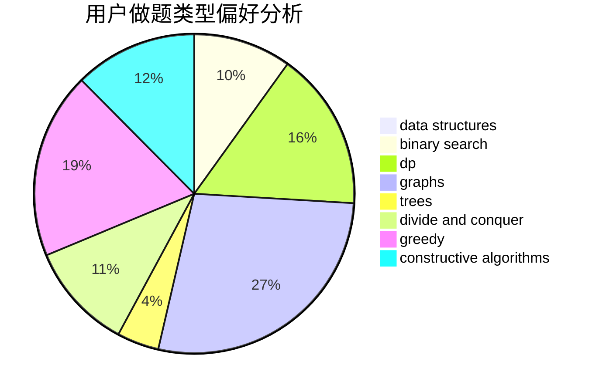
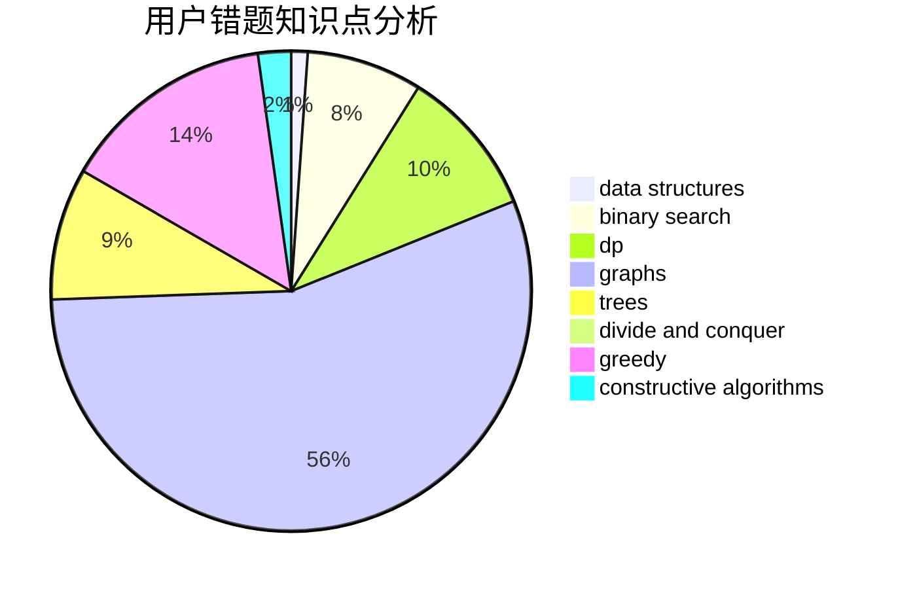

# grass8cow

<!-- tabs:start -->

#### **用户提交结果分析**

#### **用户做题类型偏好分析**

#### **用户错题知识点分析**

<!-- tabs:end -->
# 推荐题目
[199D](https://codeforces.com/contest/199/problem/D)		dsu,graphs,sortings,trees		  
[883C](https://codeforces.com/contest/883/problem/C)		binary search,
                        implementation		  
[609C](https://codeforces.com/contest/609/problem/C)		implementation,
                        math		  
[570D](https://codeforces.com/contest/570/problem/D)		binary search,
                        bitmasks,
                        constructive algorithms,
                        dfs and similar,
                        graphs,
                        trees		  
[1145C](https://codeforces.com/contest/1145/problem/C)		bitmasks,
                        brute force		  
[1119E](https://codeforces.com/contest/1119/problem/E)		brute force,
                        dp,
                        fft,
                        greedy,
                        ternary search		  
[835F](https://codeforces.com/contest/835/problem/F)		dfs and similar,
                        dp,
                        graphs,
                        trees		  
[960H](https://codeforces.com/contest/960/problem/H)		data structures,
                        trees		  
[679E](https://codeforces.com/contest/679/problem/E)		data structures		  
[526G](https://codeforces.com/contest/526/problem/G)		greedy,
                        trees		  
