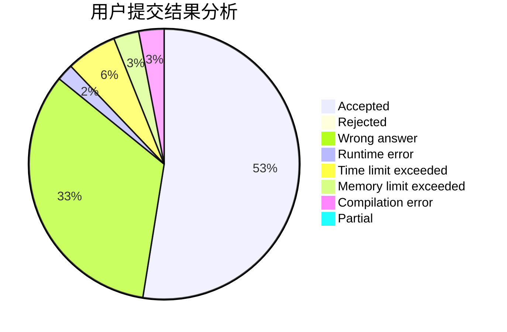
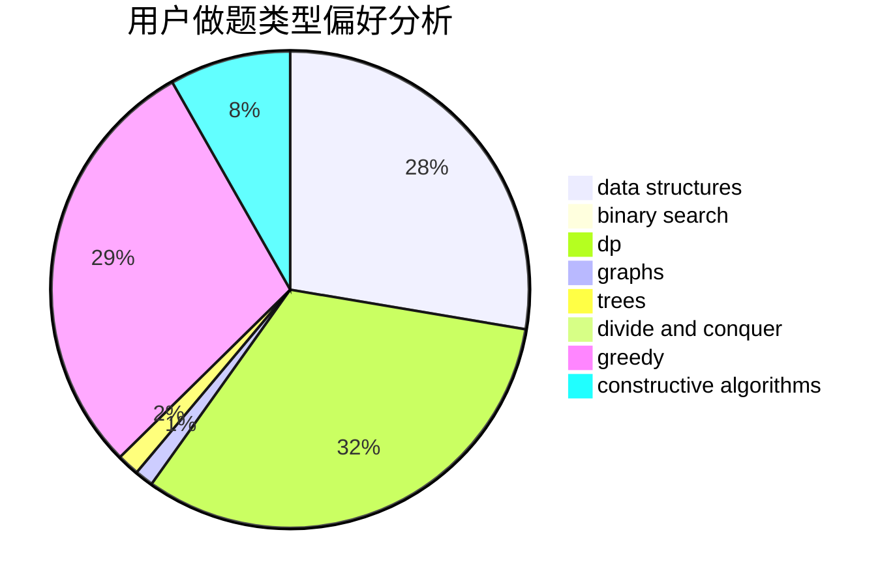
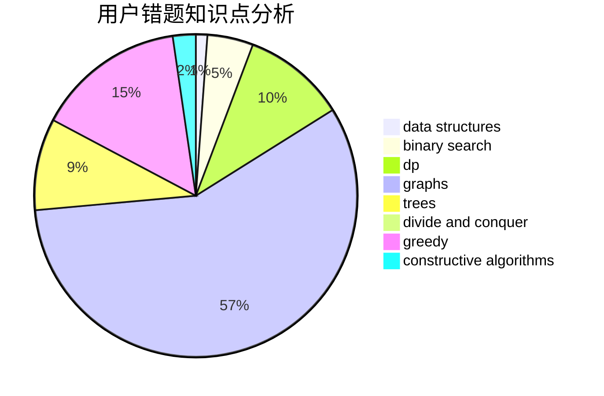

# grass8cow

<!-- tabs:start -->

#### **用户提交结果分析**

#### **用户做题类型偏好分析**

#### **用户错题知识点分析**

<!-- tabs:end -->
# 推荐题目
[220C](https://codeforces.com/contest/220/problem/C)		data structures		  
[900B](https://codeforces.com/contest/900/problem/B)		math,
                        number theory		  
[628C](https://codeforces.com/contest/628/problem/C)		greedy,
                        strings		  
[591A](https://codeforces.com/contest/591/problem/A)		implementation,
                        math		  
[1147D](https://codeforces.com/contest/1147/problem/D)		dfs and similar,
                        graphs		  
[11292](https://codeforces.com/contest/1129/problem/2)		dsu,graphs,sortings,trees		  
[853D](https://codeforces.com/contest/853/problem/D)		binary search,
                        dp,
                        greedy		  
[983A](https://codeforces.com/contest/983/problem/A)		implementation,
                        math		  
[703C](https://codeforces.com/contest/703/problem/C)		geometry,
                        implementation		  
[551A](https://codeforces.com/contest/551/problem/A)		brute force,
                        implementation,
                        sortings		  
