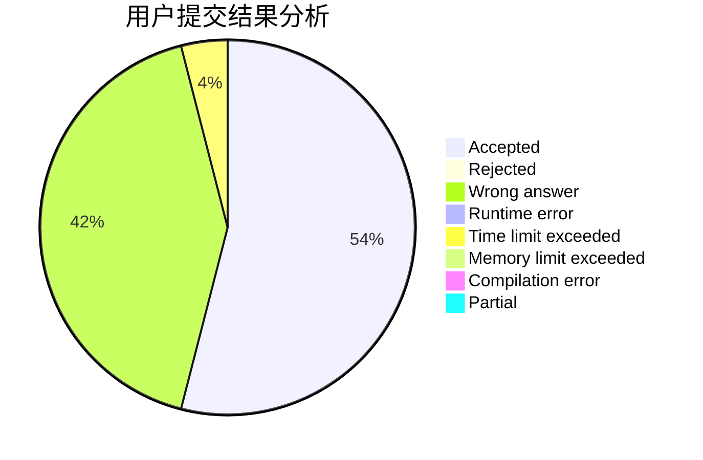
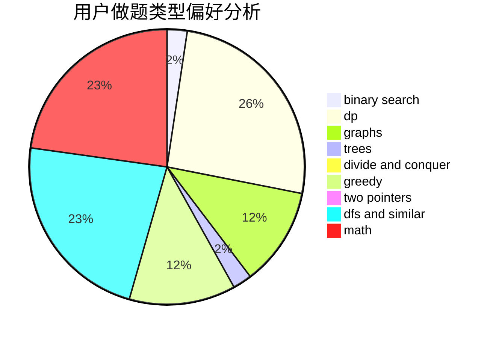

# gswsc30

<!-- tabs:start -->

#### **用户提交结果分析**

#### **用户做题类型偏好分析**

<!-- tabs:end -->
# 推荐题目
[318C](https://codeforces.com/contest/318/problem/C)
[396C](https://codeforces.com/contest/396/problem/C)
[792B](https://codeforces.com/contest/792/problem/B)
[1091H](https://codeforces.com/contest/1091/problem/H)
[11081](https://codeforces.com/contest/1108/problem/1)
[295A](https://codeforces.com/contest/295/problem/A)
[737A](https://codeforces.com/contest/737/problem/A)
[37A](https://codeforces.com/contest/37/problem/A)
[1388E](https://codeforces.com/contest/1388/problem/E)
[913B](https://codeforces.com/contest/913/problem/B)
