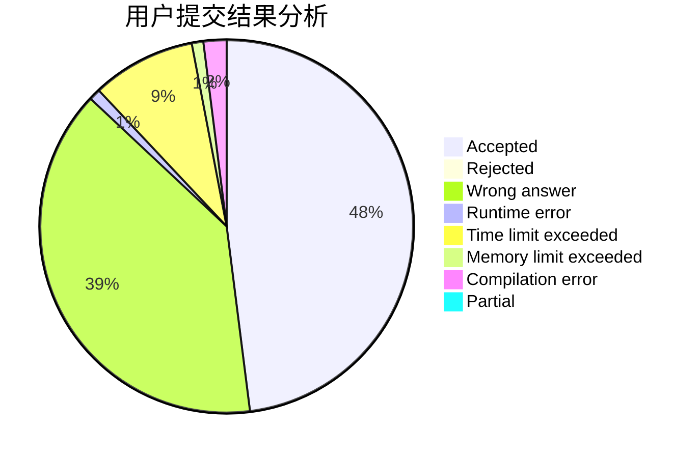
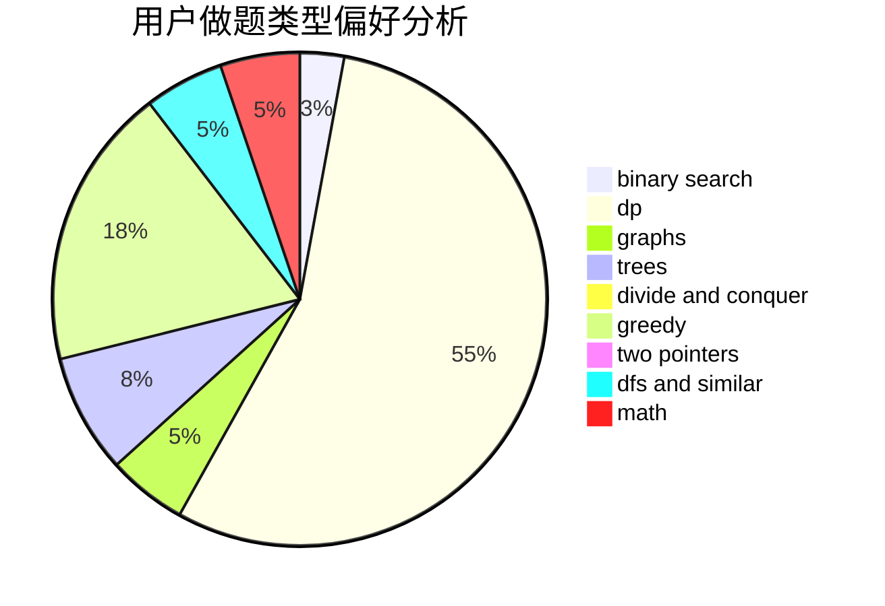

# guagualoveyou

<!-- tabs:start -->

#### **用户提交结果分析**

#### **用户做题类型偏好分析**

<!-- tabs:end -->
# 推荐题目
[20A](https://codeforces.com/contest/20/problem/A)
[758F](https://codeforces.com/contest/758/problem/F)
[10C](https://codeforces.com/contest/10/problem/C)
[1501E](https://codeforces.com/contest/1501/problem/E)
[825F](https://codeforces.com/contest/825/problem/F)
[356C](https://codeforces.com/contest/356/problem/C)
[956D](https://codeforces.com/contest/956/problem/D)
[549C](https://codeforces.com/contest/549/problem/C)
[215A](https://codeforces.com/contest/215/problem/A)
[1358E](https://codeforces.com/contest/1358/problem/E)
