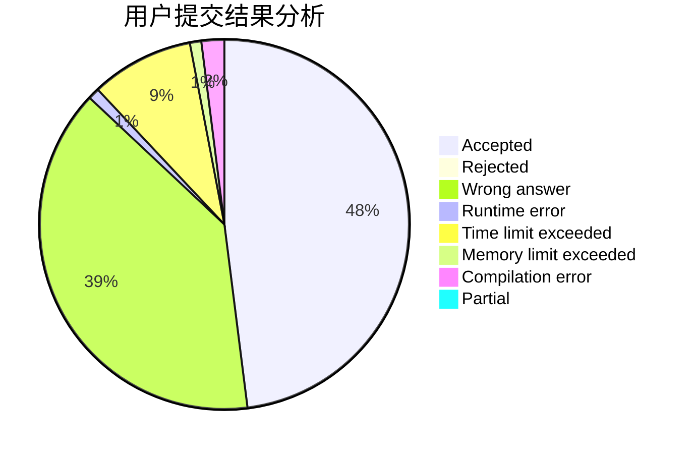
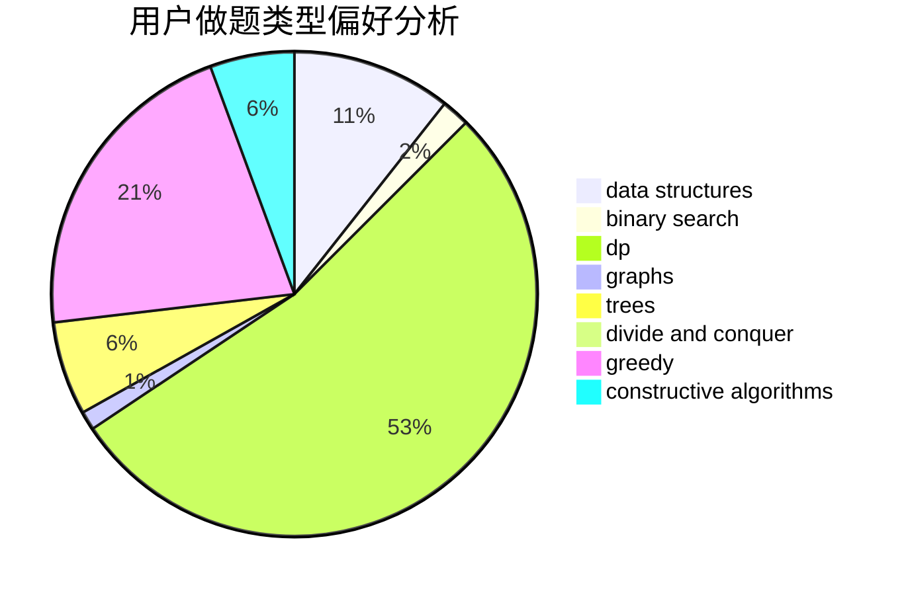
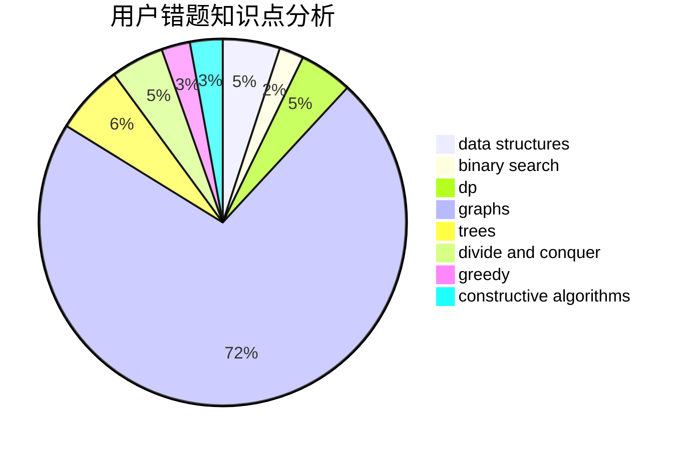

# guagualoveyou

<!-- tabs:start -->

#### **用户提交结果分析**

#### **用户做题类型偏好分析**

#### **用户错题知识点分析**

<!-- tabs:end -->
# 推荐题目
[183D](https://codeforces.com/contest/183/problem/D)		dp,
                        greedy,
                        probabilities		  
[737B](https://codeforces.com/contest/737/problem/B)		dsu,graphs,sortings,trees		  
[109A](https://codeforces.com/contest/109/problem/A)		brute force,
                        implementation		  
[1493E](https://codeforces.com/contest/1493/problem/E)		bitmasks,
                        constructive algorithms,
                        greedy,
                        math,
                        strings,
                        two pointers		  
[808G](https://codeforces.com/contest/808/problem/G)		dp,
                        strings		  
[327D](https://codeforces.com/contest/327/problem/D)		constructive algorithms,
                        dfs and similar,
                        graphs		  
[934E](https://codeforces.com/contest/934/problem/E)		dsu,graphs,sortings,trees		  
[524F](https://codeforces.com/contest/524/problem/F)		data structures,
                        greedy,
                        hashing,
                        string suffix structures,
                        strings		  
[18A](https://codeforces.com/contest/18/problem/A)		brute force,
                        geometry		  
[1352A](https://codeforces.com/contest/1352/problem/A)		implementation,
                        math		  
