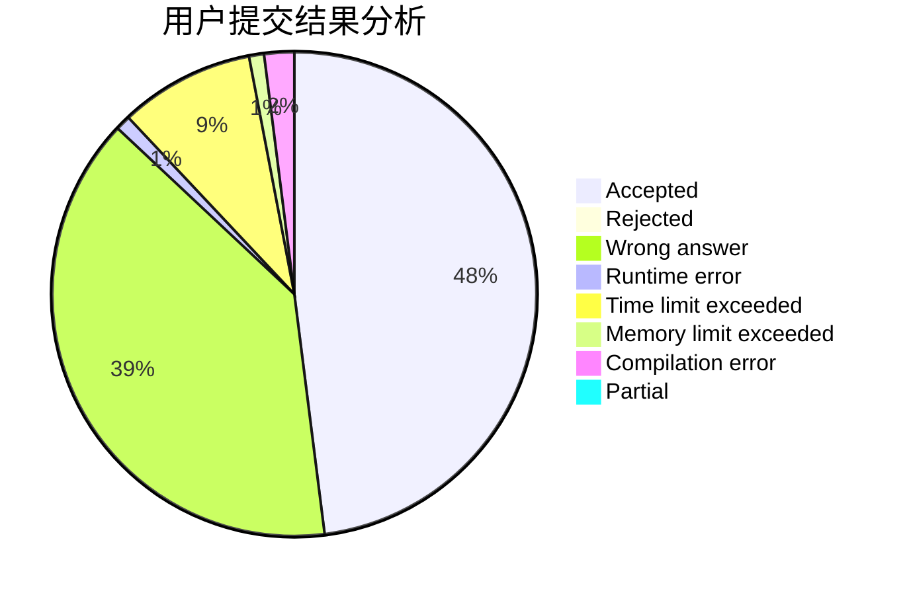
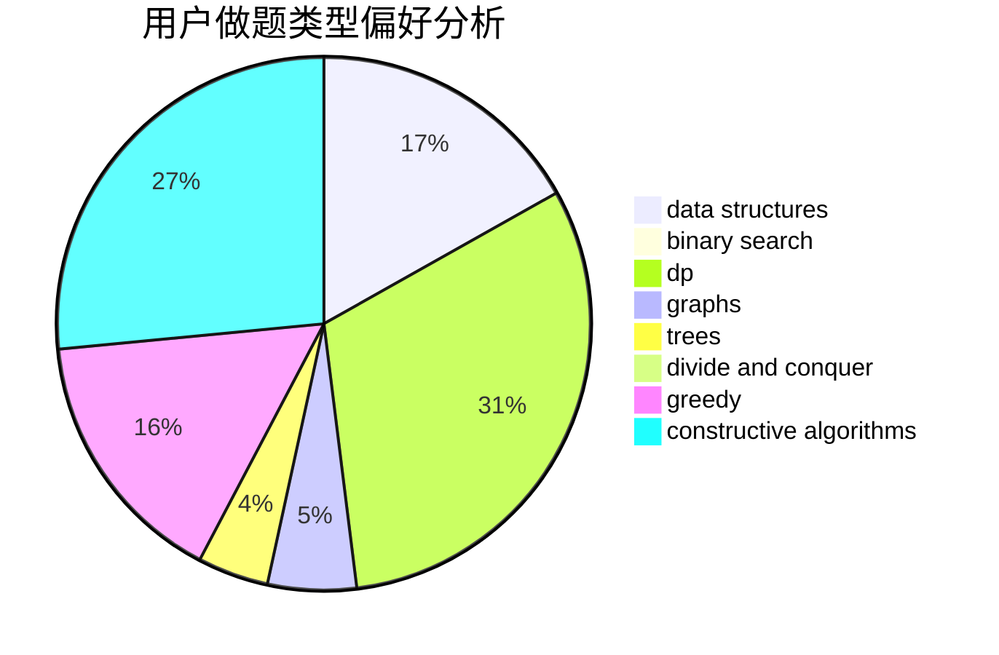
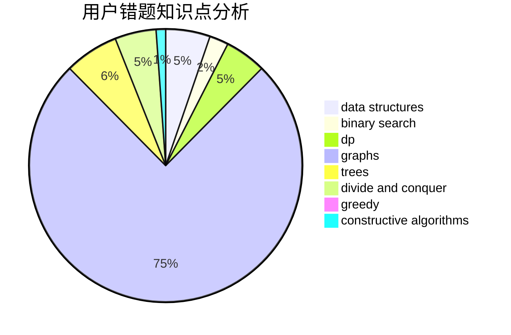

# guagualoveyou

<!-- tabs:start -->

#### **用户提交结果分析**

#### **用户做题类型偏好分析**

#### **用户错题知识点分析**

<!-- tabs:end -->
# 推荐题目
[20A](https://codeforces.com/contest/20/problem/A)		implementation		  
[758F](https://codeforces.com/contest/758/problem/F)		brute force,
                        math,
                        number theory		  
[10C](https://codeforces.com/contest/10/problem/C)		number theory		  
[1501E](https://codeforces.com/contest/1501/problem/E)		dsu,graphs,sortings,trees		  
[825F](https://codeforces.com/contest/825/problem/F)		dp,
                        hashing,
                        string suffix structures,
                        strings		  
[356C](https://codeforces.com/contest/356/problem/C)		combinatorics,
                        constructive algorithms,
                        greedy,
                        implementation		  
[956D](https://codeforces.com/contest/956/problem/D)		dsu,graphs,sortings,trees		  
[549C](https://codeforces.com/contest/549/problem/C)		games		  
[215A](https://codeforces.com/contest/215/problem/A)		brute force,
                        implementation		  
[1358E](https://codeforces.com/contest/1358/problem/E)		constructive algorithms,
                        data structures,
                        greedy,
                        implementation		  
