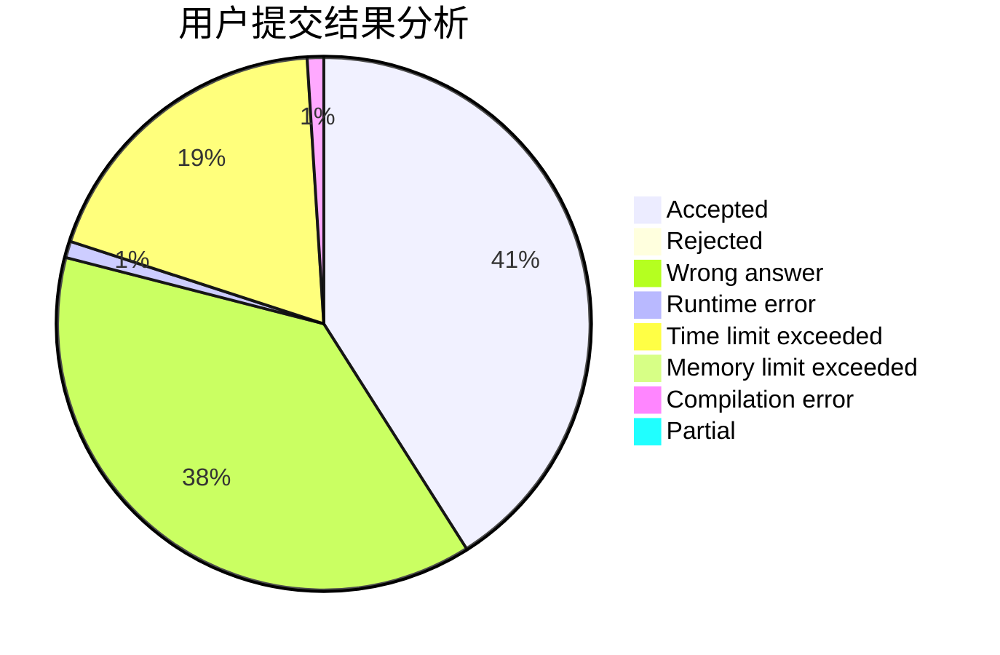
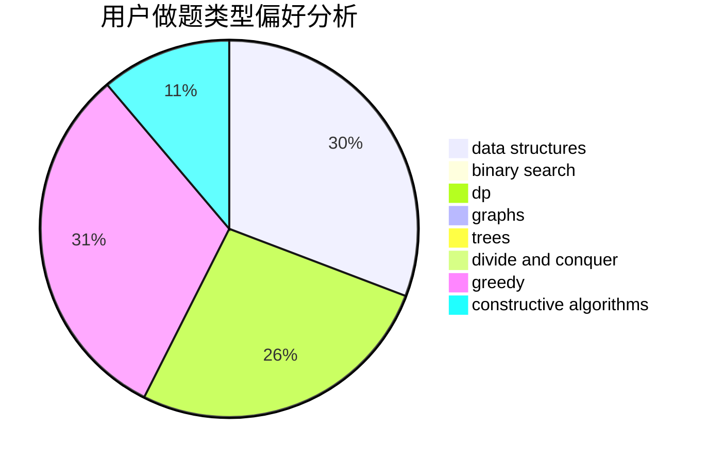
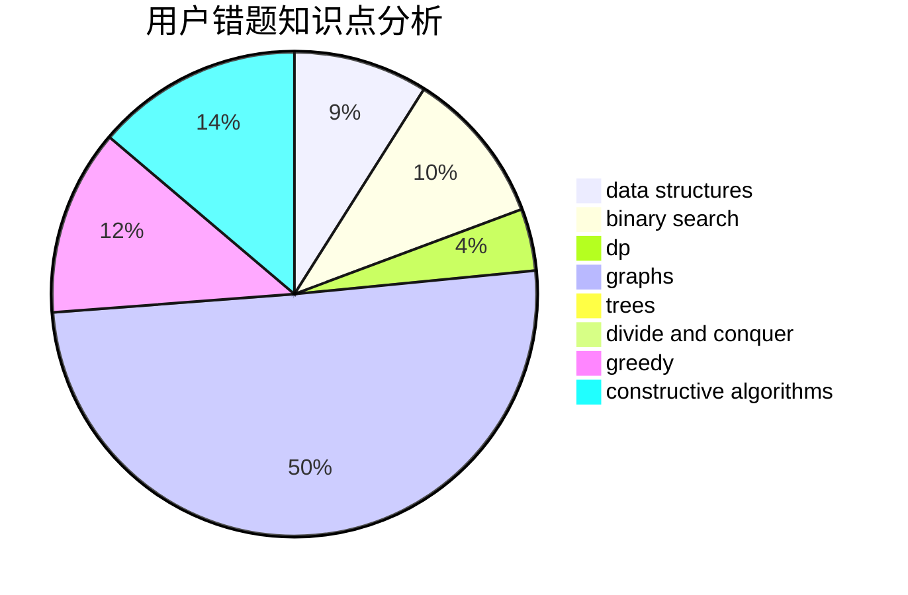

# guanhuai04

<!-- tabs:start -->

#### **用户提交结果分析**

#### **用户做题类型偏好分析**

#### **用户错题知识点分析**

<!-- tabs:end -->
# 推荐题目
[343A](https://codeforces.com/contest/343/problem/A)		math,
                        number theory		  
[1423C](https://codeforces.com/contest/1423/problem/C)		divide and conquer,
                        graphs,
                        trees		  
[725B](https://codeforces.com/contest/725/problem/B)		implementation,
                        math		  
[1162E](https://codeforces.com/contest/1162/problem/E)		dsu,graphs,sortings,trees		  
[294C](https://codeforces.com/contest/294/problem/C)		combinatorics,
                        number theory		  
[610B](https://codeforces.com/contest/610/problem/B)		constructive algorithms,
                        implementation		  
[762F](https://codeforces.com/contest/762/problem/F)		combinatorics,
                        graphs,
                        trees		  
[696F](https://codeforces.com/contest/696/problem/F)		binary search,
                        geometry,
                        two pointers		  
[989D](https://codeforces.com/contest/989/problem/D)		binary search,
                        geometry,
                        math,
                        sortings,
                        two pointers		  
[1270I](https://codeforces.com/contest/1270/problem/I)		constructive algorithms,
                        fft,
                        math		  
