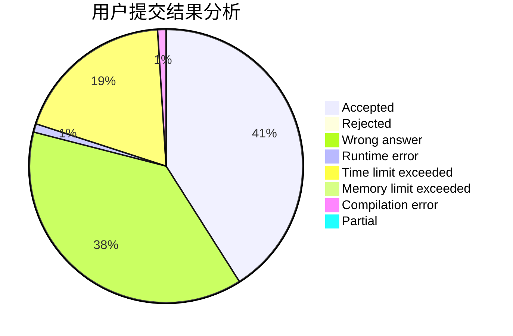
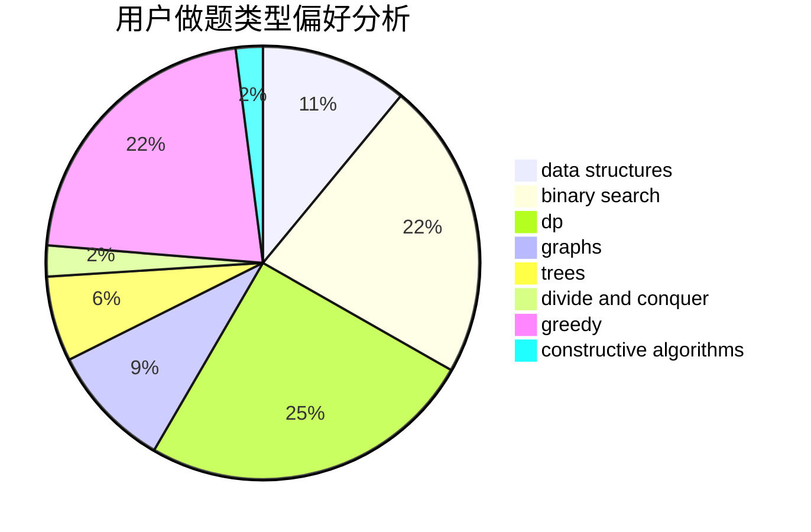
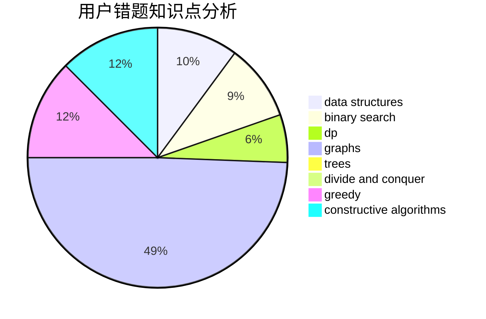

# guanhuai04

<!-- tabs:start -->

#### **用户提交结果分析**

#### **用户做题类型偏好分析**

#### **用户错题知识点分析**

<!-- tabs:end -->
# 推荐题目
[316E2](https://codeforces.com/contest/316E/problem/2)		data structures,
                        math		  
[1413F](https://codeforces.com/contest/1413/problem/F)		data structures,
                        trees		  
[706E](https://codeforces.com/contest/706/problem/E)		data structures,
                        implementation		  
[115A](https://codeforces.com/contest/115/problem/A)		dfs and similar,
                        graphs,
                        trees		  
[279D](https://codeforces.com/contest/279/problem/D)		bitmasks,
                        dp		  
[590D](https://codeforces.com/contest/590/problem/D)		dp		  
[742C](https://codeforces.com/contest/742/problem/C)		dsu,graphs,sortings,trees		  
[671A](https://codeforces.com/contest/671/problem/A)		dp,
                        geometry,
                        greedy,
                        implementation		  
[96B](https://codeforces.com/contest/96/problem/B)		binary search,
                        bitmasks,
                        brute force		  
[1265D](https://codeforces.com/contest/1265/problem/D)		dsu,graphs,sortings,trees		  
