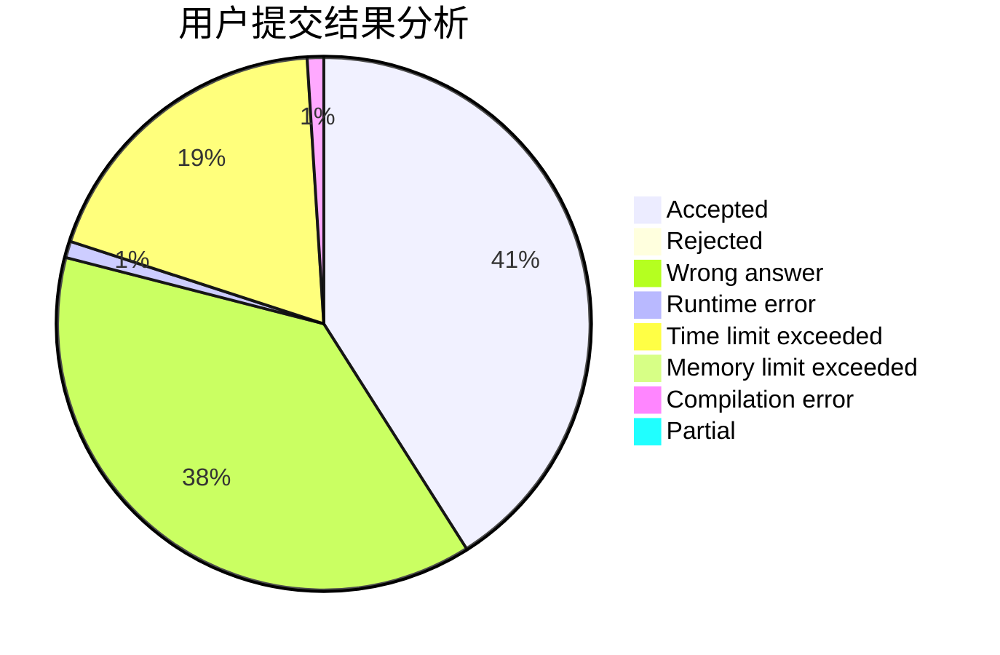
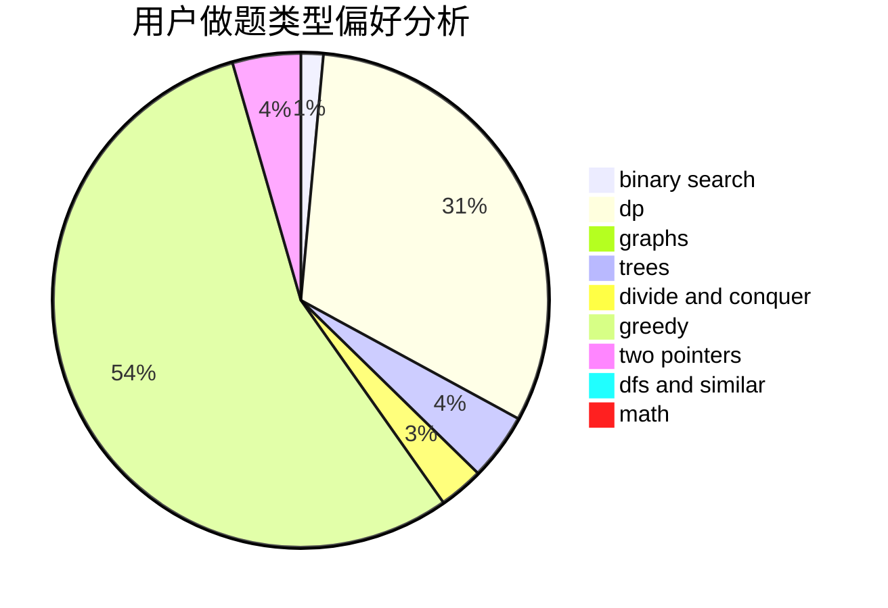

# guanhuai04

<!-- tabs:start -->

#### **用户提交结果分析**

#### **用户做题类型偏好分析**

<!-- tabs:end -->
# 推荐题目
[343A](https://codeforces.com/contest/343/problem/A)
[1423C](https://codeforces.com/contest/1423/problem/C)
[725B](https://codeforces.com/contest/725/problem/B)
[1162E](https://codeforces.com/contest/1162/problem/E)
[294C](https://codeforces.com/contest/294/problem/C)
[610B](https://codeforces.com/contest/610/problem/B)
[762F](https://codeforces.com/contest/762/problem/F)
[696F](https://codeforces.com/contest/696/problem/F)
[989D](https://codeforces.com/contest/989/problem/D)
[1270I](https://codeforces.com/contest/1270/problem/I)
