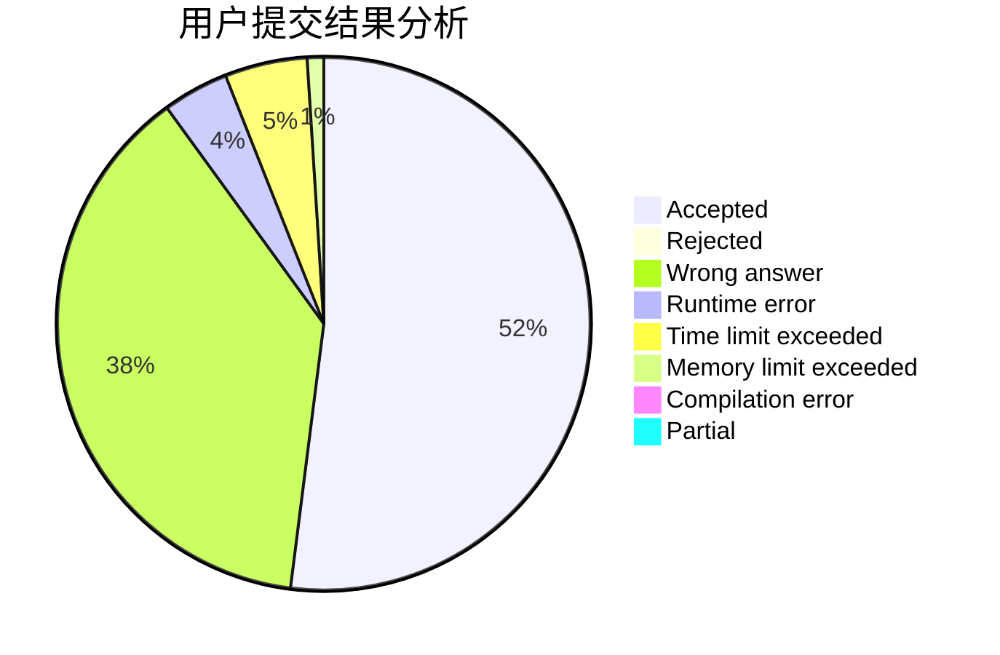
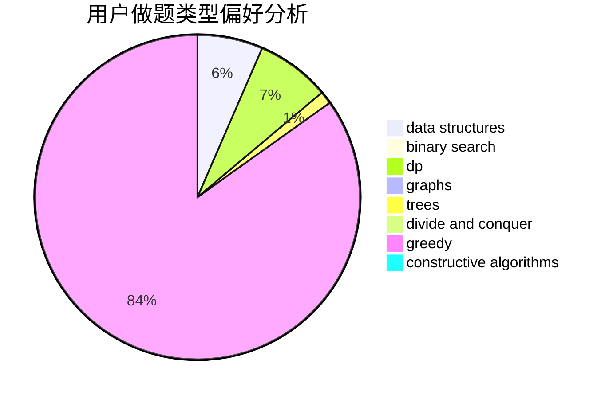

# guapisolo

<!-- tabs:start -->

#### **用户提交结果分析**

#### **用户做题类型偏好分析**

#### **用户错题知识点分析**

<!-- tabs:end -->
# 推荐题目
[915D](https://codeforces.com/contest/915/problem/D)		dfs and similar,
                        graphs		  
[1007C](https://codeforces.com/contest/1007/problem/C)		binary search,
                        interactive		  
[696F](https://codeforces.com/contest/696/problem/F)		binary search,
                        geometry,
                        two pointers		  
[736A](https://codeforces.com/contest/736/problem/A)		dsu,graphs,sortings,trees		  
[525E](https://codeforces.com/contest/525/problem/E)		binary search,
                        bitmasks,
                        brute force,
                        dp,
                        math,
                        meet-in-the-middle		  
[54B](https://codeforces.com/contest/54/problem/B)		hashing,
                        implementation		  
[907A](https://codeforces.com/contest/907/problem/A)		brute force,
                        implementation		  
[776C](https://codeforces.com/contest/776/problem/C)		binary search,
                        brute force,
                        data structures,
                        implementation,
                        math		  
[792C](https://codeforces.com/contest/792/problem/C)		dp,
                        greedy,
                        math,
                        number theory		  
[797B](https://codeforces.com/contest/797/problem/B)		dp,
                        greedy,
                        implementation		  
