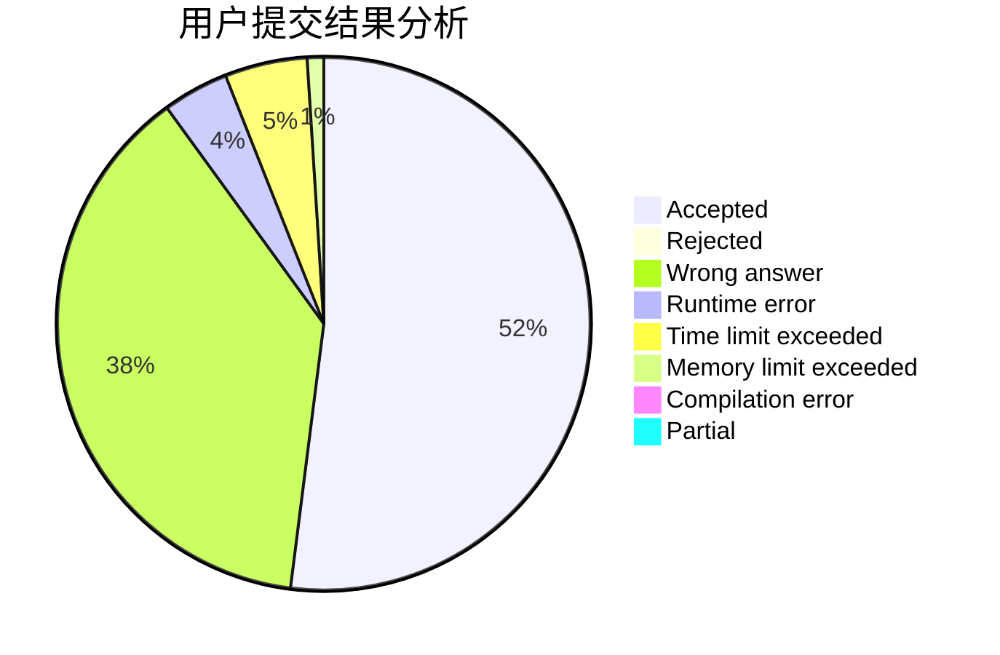
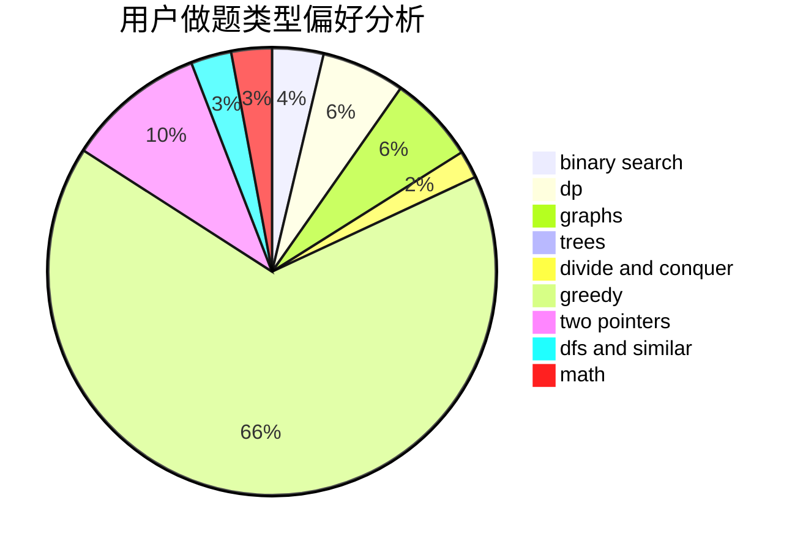

# guapisolo

<!-- tabs:start -->

#### **用户提交结果分析**

#### **用户做题类型偏好分析**

<!-- tabs:end -->
# 推荐题目
[935C](https://codeforces.com/contest/935/problem/C)
[1008A](https://codeforces.com/contest/1008/problem/A)
[713D](https://codeforces.com/contest/713/problem/D)
[757F](https://codeforces.com/contest/757/problem/F)
[54B](https://codeforces.com/contest/54/problem/B)
[575B](https://codeforces.com/contest/575/problem/B)
[920E](https://codeforces.com/contest/920/problem/E)
[794B](https://codeforces.com/contest/794/problem/B)
[808B](https://codeforces.com/contest/808/problem/B)
[811A](https://codeforces.com/contest/811/problem/A)
