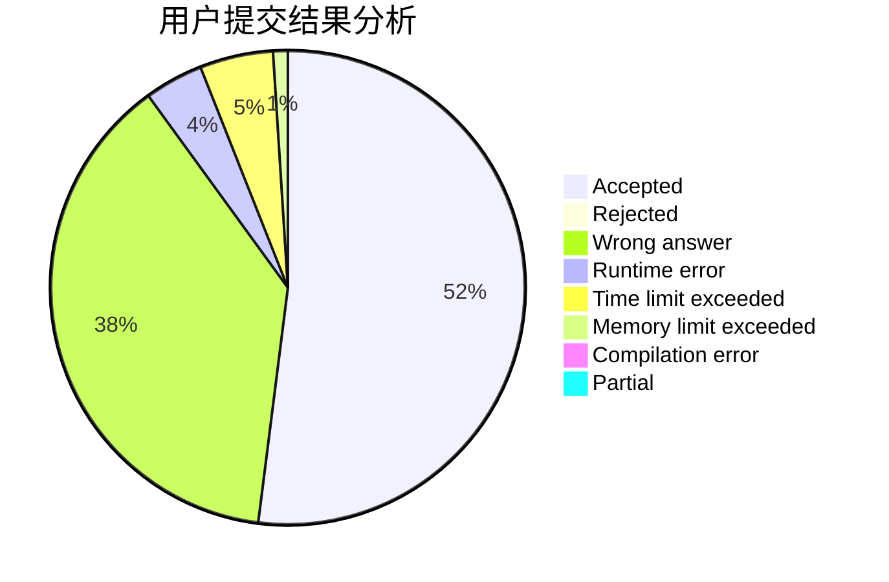
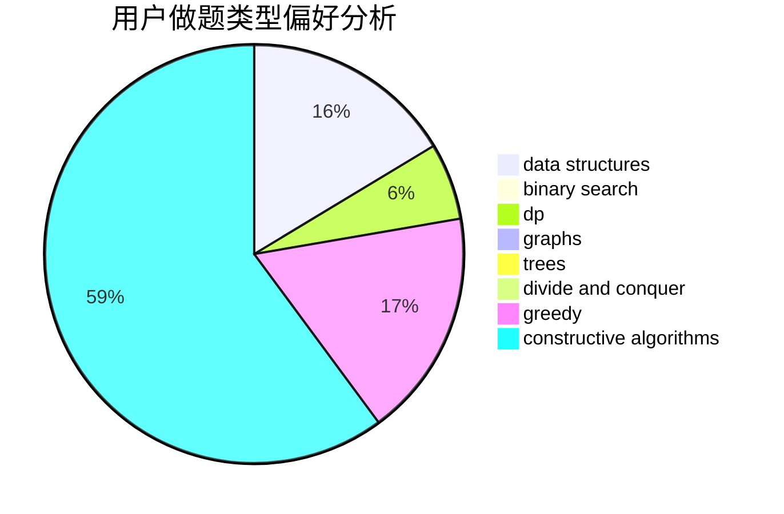

# guapisolo

<!-- tabs:start -->

#### **用户提交结果分析**

#### **用户做题类型偏好分析**

#### **用户错题知识点分析**

<!-- tabs:end -->
# 推荐题目
[935C](https://codeforces.com/contest/935/problem/C)		geometry		  
[1008A](https://codeforces.com/contest/1008/problem/A)		implementation,
                        strings		  
[713D](https://codeforces.com/contest/713/problem/D)		binary search,
                        data structures		  
[757F](https://codeforces.com/contest/757/problem/F)		data structures,
                        graphs,
                        shortest paths		  
[54B](https://codeforces.com/contest/54/problem/B)		hashing,
                        implementation		  
[575B](https://codeforces.com/contest/575/problem/B)		dfs and similar,
                        graphs,
                        trees		  
[920E](https://codeforces.com/contest/920/problem/E)		data structures,
                        dfs and similar,
                        dsu,
                        graphs		  
[794B](https://codeforces.com/contest/794/problem/B)		geometry,
                        math		  
[808B](https://codeforces.com/contest/808/problem/B)		data structures,
                        implementation,
                        math		  
[811A](https://codeforces.com/contest/811/problem/A)		brute force,
                        implementation		  
