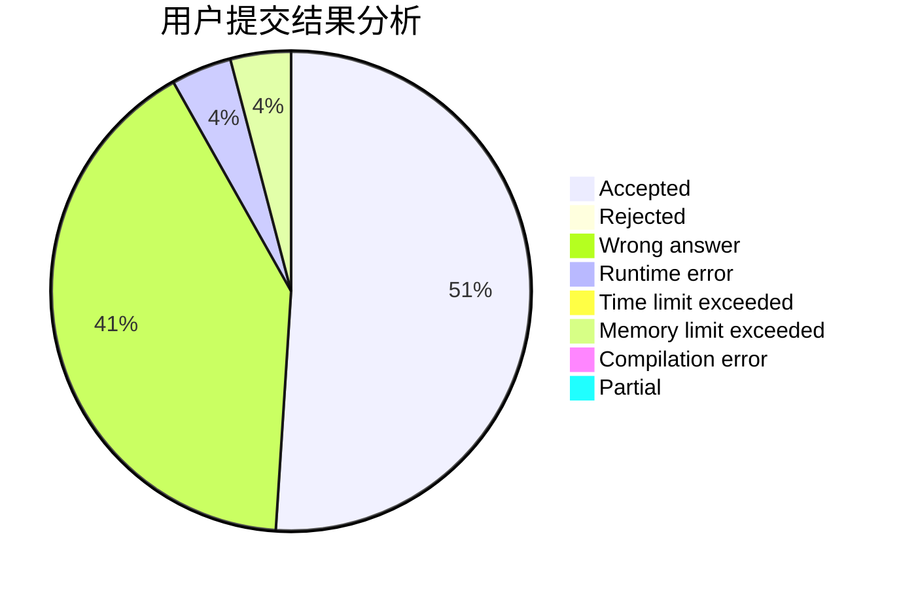
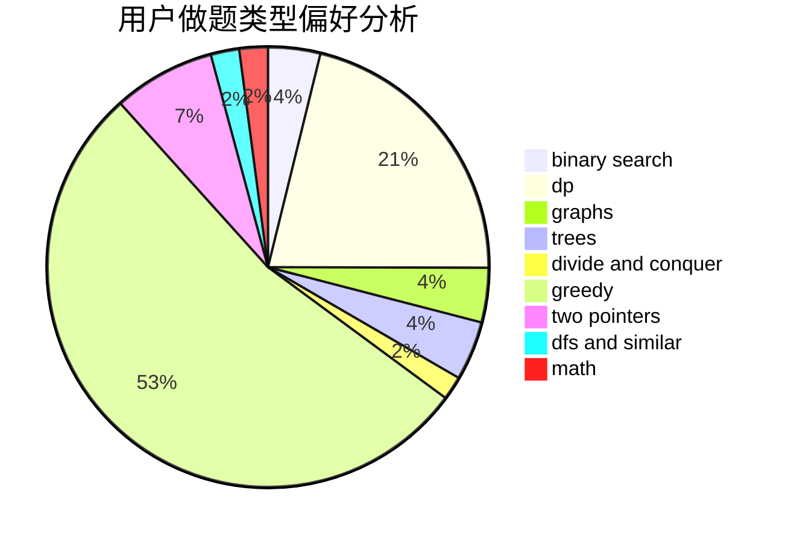

# gujunkai01

<!-- tabs:start -->

#### **用户提交结果分析**

#### **用户做题类型偏好分析**

<!-- tabs:end -->
# 推荐题目
[913G](https://codeforces.com/contest/913/problem/G)
[47E](https://codeforces.com/contest/47/problem/E)
[567A](https://codeforces.com/contest/567/problem/A)
[795K](https://codeforces.com/contest/795/problem/K)
[960A](https://codeforces.com/contest/960/problem/A)
[699D](https://codeforces.com/contest/699/problem/D)
[11962](https://codeforces.com/contest/1196/problem/2)
[367C](https://codeforces.com/contest/367/problem/C)
[1174E](https://codeforces.com/contest/1174/problem/E)
[772E](https://codeforces.com/contest/772/problem/E)
