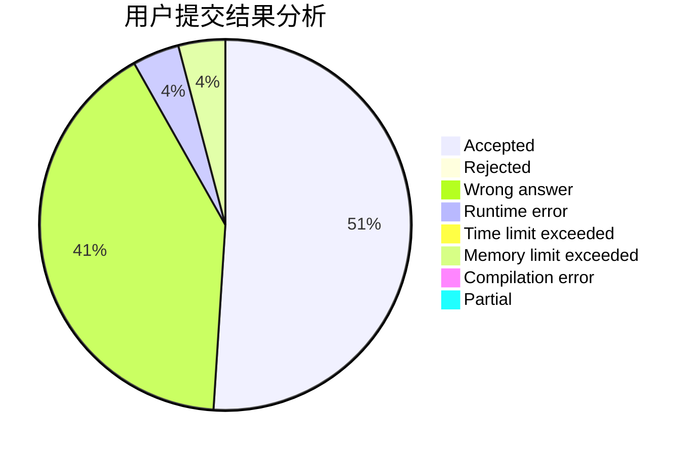
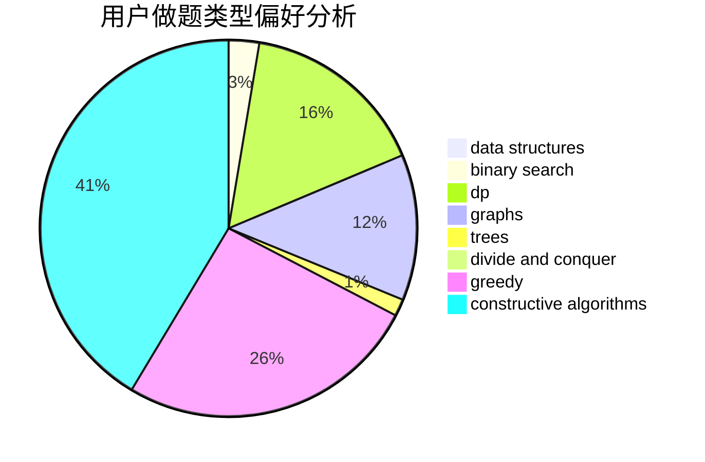
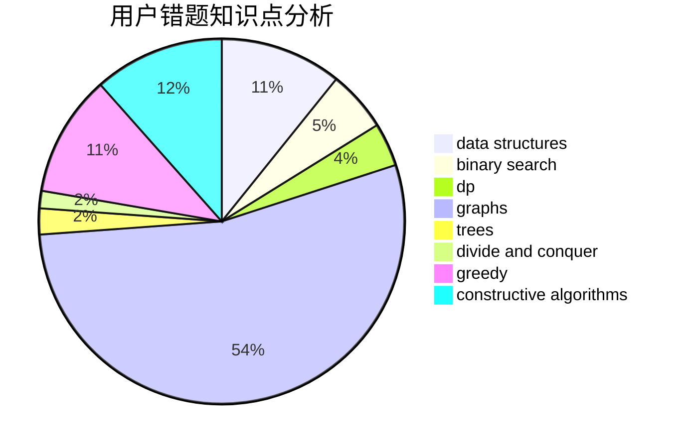

# gujunkai01

<!-- tabs:start -->

#### **用户提交结果分析**

#### **用户做题类型偏好分析**

#### **用户错题知识点分析**

<!-- tabs:end -->
# 推荐题目
[896D](https://codeforces.com/contest/896/problem/D)		chinese remainder theorem,
                        combinatorics,
                        math,
                        number theory		  
[460E](https://codeforces.com/contest/460/problem/E)		brute force,
                        geometry,
                        math,
                        sortings		  
[542E](https://codeforces.com/contest/542/problem/E)		graphs,
                        shortest paths		  
[777C](https://codeforces.com/contest/777/problem/C)		binary search,
                        data structures,
                        dp,
                        greedy,
                        implementation,
                        two pointers		  
[938E](https://codeforces.com/contest/938/problem/E)		combinatorics,
                        math		  
[674G](https://codeforces.com/contest/674/problem/G)		dsu,graphs,sortings,trees		  
[1190B](https://codeforces.com/contest/1190/problem/B)		games		  
[33C](https://codeforces.com/contest/33/problem/C)		greedy		  
[1172C1](https://codeforces.com/contest/1172C/problem/1)		dp,
                        probabilities		  
[754D](https://codeforces.com/contest/754/problem/D)		binary search,
                        data structures,
                        greedy,
                        sortings		  
