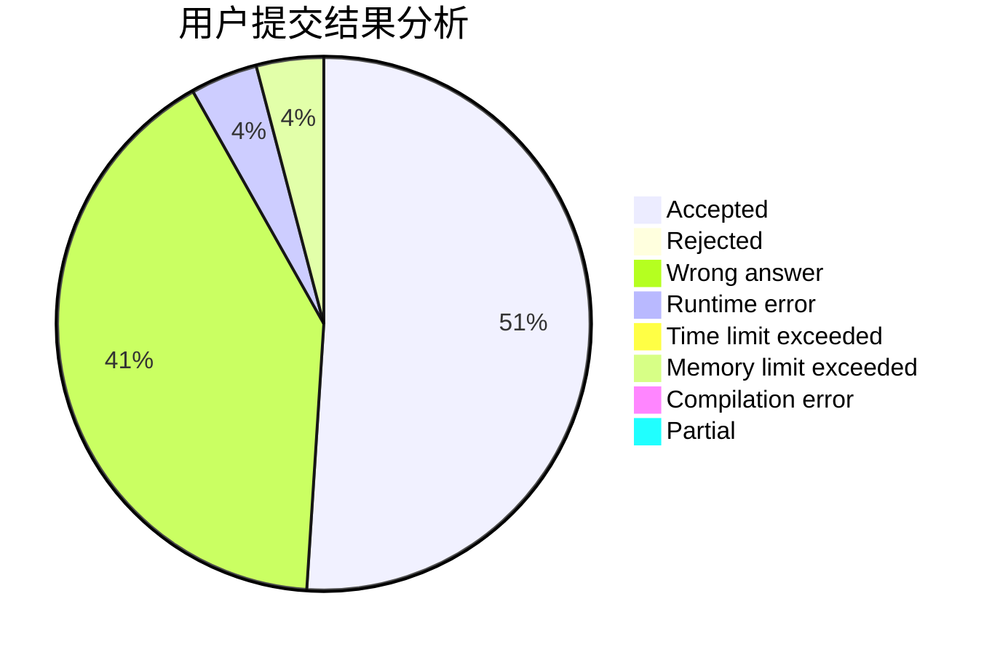
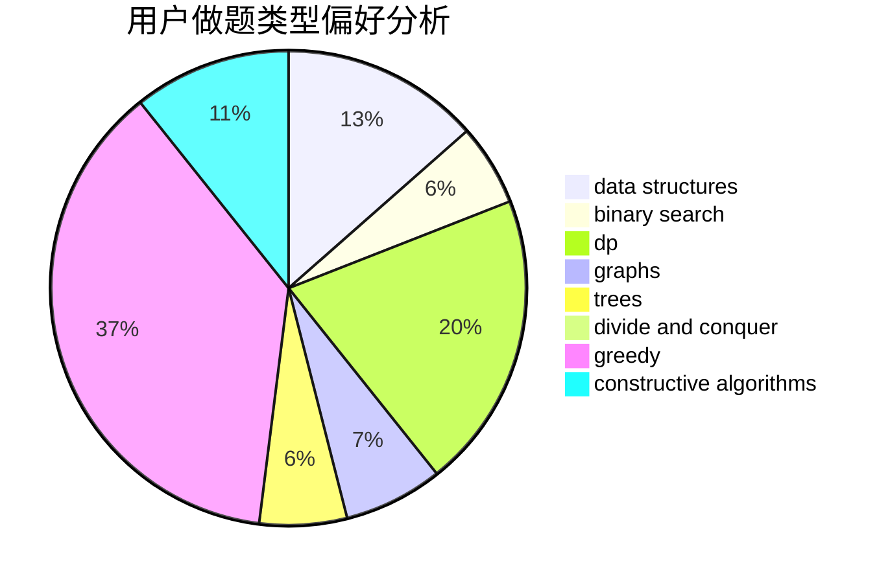
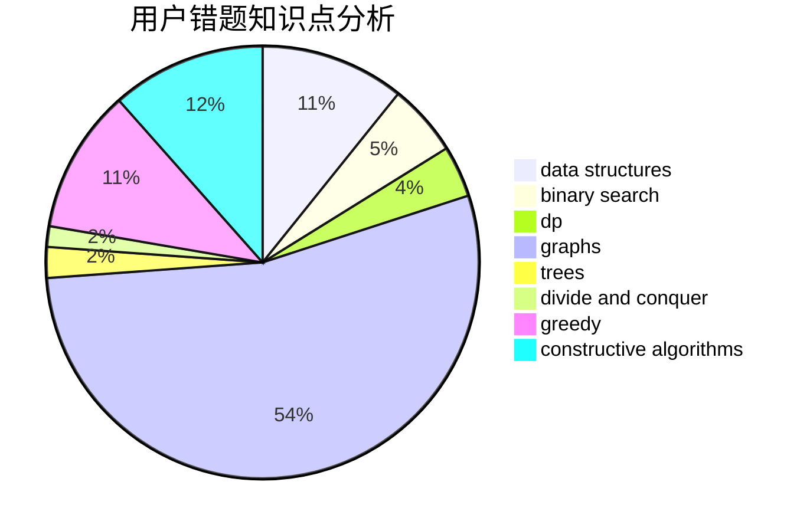

# gujunkai01

<!-- tabs:start -->

#### **用户提交结果分析**

#### **用户做题类型偏好分析**

#### **用户错题知识点分析**

<!-- tabs:end -->
# 推荐题目
[913G](https://codeforces.com/contest/913/problem/G)		math,
                        number theory		  
[47E](https://codeforces.com/contest/47/problem/E)		data structures,
                        geometry,
                        sortings		  
[567A](https://codeforces.com/contest/567/problem/A)		greedy,
                        implementation		  
[795K](https://codeforces.com/contest/795/problem/K)		dsu,graphs,sortings,trees		  
[960A](https://codeforces.com/contest/960/problem/A)		implementation		  
[699D](https://codeforces.com/contest/699/problem/D)		dsu,graphs,sortings,trees		  
[11962](https://codeforces.com/contest/1196/problem/2)		dsu,graphs,sortings,trees		  
[367C](https://codeforces.com/contest/367/problem/C)		graphs,
                        greedy,
                        sortings		  
[1174E](https://codeforces.com/contest/1174/problem/E)		combinatorics,
                        dp,
                        math,
                        number theory		  
[772E](https://codeforces.com/contest/772/problem/E)		binary search,
                        divide and conquer,
                        interactive,
                        trees		  
