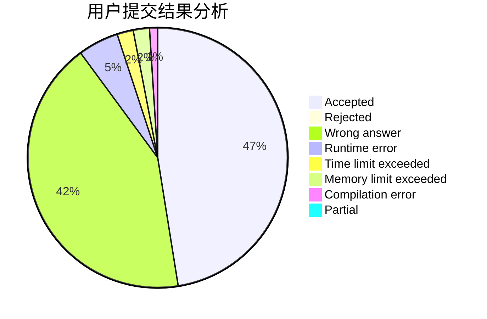
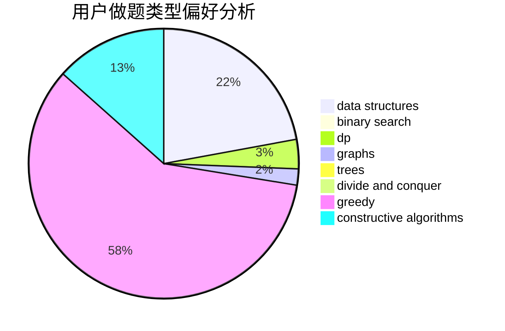
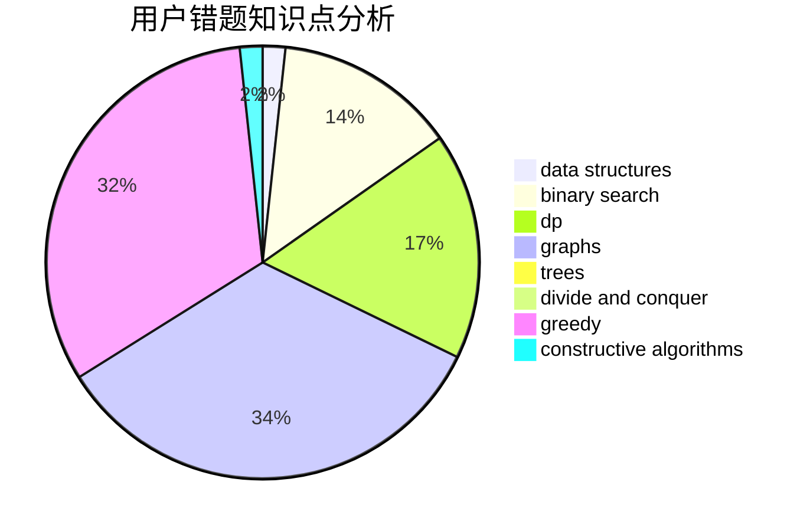

# guoyifan

<!-- tabs:start -->

#### **用户提交结果分析**

#### **用户做题类型偏好分析**

#### **用户错题知识点分析**

<!-- tabs:end -->
# 推荐题目
[1030B](https://codeforces.com/contest/1030/problem/B)		geometry		  
[453B](https://codeforces.com/contest/453/problem/B)		bitmasks,
                        brute force,
                        dp		  
[581B](https://codeforces.com/contest/581/problem/B)		implementation,
                        math		  
[909A](https://codeforces.com/contest/909/problem/A)		brute force,
                        greedy,
                        sortings		  
[1291B](https://codeforces.com/contest/1291/problem/B)		greedy,
                        implementation		  
[359C](https://codeforces.com/contest/359/problem/C)		math,
                        number theory		  
[1202F](https://codeforces.com/contest/1202/problem/F)		binary search,
                        implementation,
                        math		  
[1358F](https://codeforces.com/contest/1358/problem/F)		binary search,
                        constructive algorithms,
                        greedy,
                        implementation		  
[443D](https://codeforces.com/contest/443/problem/D)		dsu,graphs,sortings,trees		  
[47E](https://codeforces.com/contest/47/problem/E)		data structures,
                        geometry,
                        sortings		  
