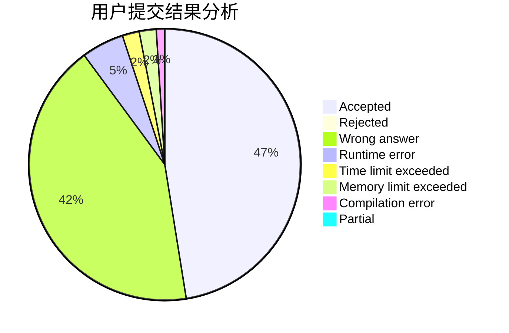
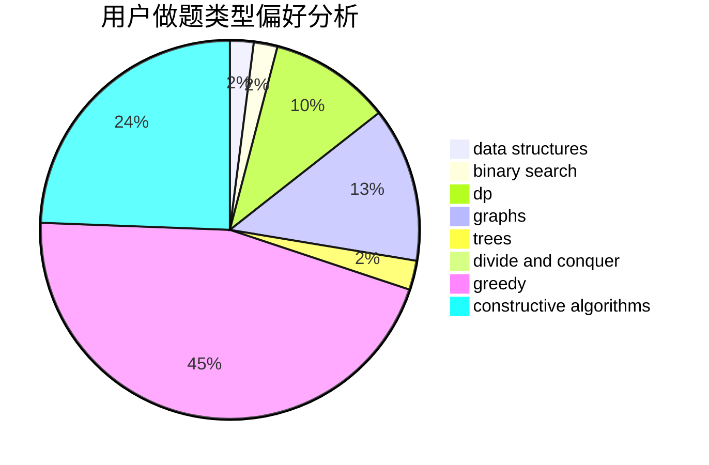
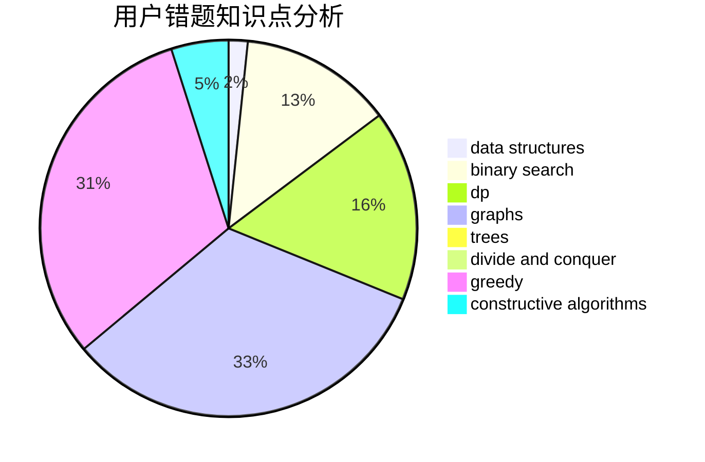

# guoyifan

<!-- tabs:start -->

#### **用户提交结果分析**

#### **用户做题类型偏好分析**

#### **用户错题知识点分析**

<!-- tabs:end -->
# 推荐题目
[102A](https://codeforces.com/contest/102/problem/A)		brute force		  
[431D](https://codeforces.com/contest/431/problem/D)		binary search,
                        bitmasks,
                        combinatorics,
                        dp,
                        math		  
[558D](https://codeforces.com/contest/558/problem/D)		data structures,
                        implementation,
                        sortings		  
[88A](https://codeforces.com/contest/88/problem/A)		brute force,
                        implementation		  
[1284B](https://codeforces.com/contest/1284/problem/B)		binary search,
                        combinatorics,
                        data structures,
                        dp,
                        implementation,
                        sortings		  
[331C3](https://codeforces.com/contest/331C/problem/3)		dp		  
[1199B](https://codeforces.com/contest/1199/problem/B)		geometry,
                        math		  
[1352B](https://codeforces.com/contest/1352/problem/B)		constructive algorithms,
                        math		  
[418C](https://codeforces.com/contest/418/problem/C)		dsu,graphs,sortings,trees		  
[460E](https://codeforces.com/contest/460/problem/E)		brute force,
                        geometry,
                        math,
                        sortings		  
