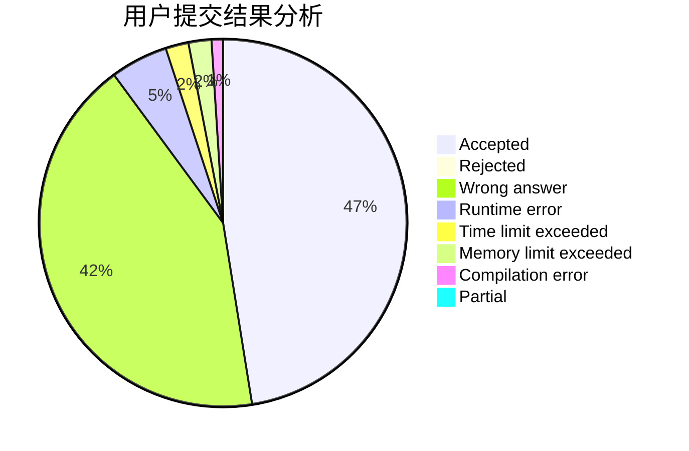
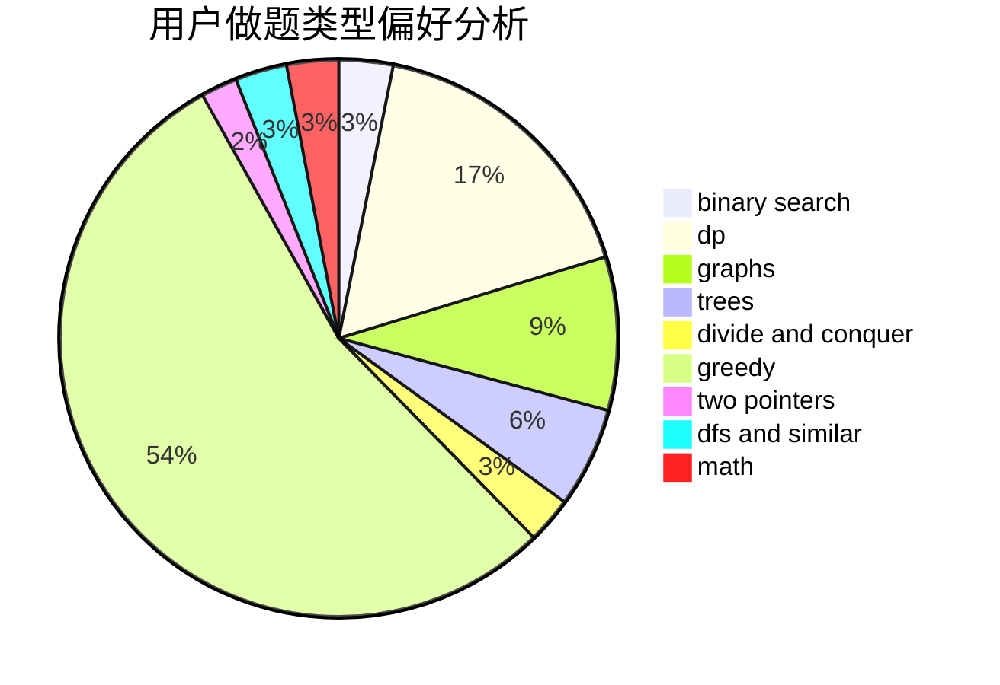

# guoyifan

<!-- tabs:start -->

#### **用户提交结果分析**

#### **用户做题类型偏好分析**

<!-- tabs:end -->
# 推荐题目
[1030B](https://codeforces.com/contest/1030/problem/B)
[453B](https://codeforces.com/contest/453/problem/B)
[581B](https://codeforces.com/contest/581/problem/B)
[909A](https://codeforces.com/contest/909/problem/A)
[1291B](https://codeforces.com/contest/1291/problem/B)
[359C](https://codeforces.com/contest/359/problem/C)
[1202F](https://codeforces.com/contest/1202/problem/F)
[1358F](https://codeforces.com/contest/1358/problem/F)
[443D](https://codeforces.com/contest/443/problem/D)
[47E](https://codeforces.com/contest/47/problem/E)
