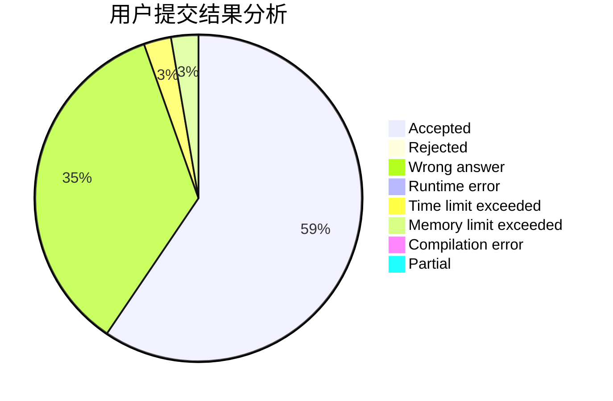
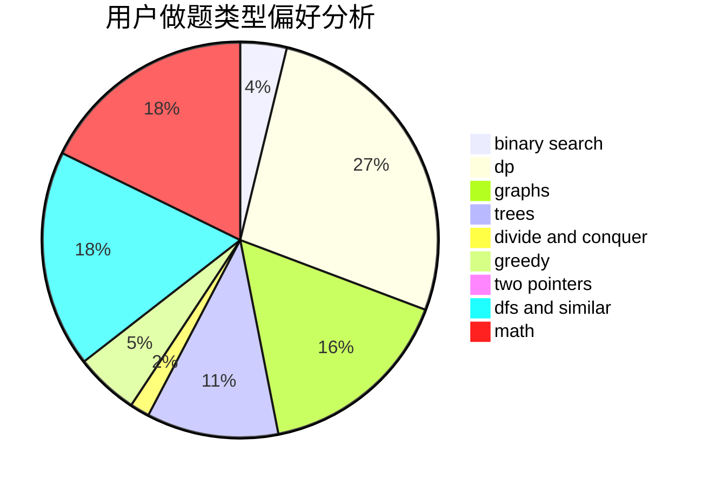

# gutc2019

<!-- tabs:start -->

#### **用户提交结果分析**

#### **用户做题类型偏好分析**

<!-- tabs:end -->
# 推荐题目
[271D](https://codeforces.com/contest/271/problem/D)
[813F](https://codeforces.com/contest/813/problem/F)
[725B](https://codeforces.com/contest/725/problem/B)
[699C](https://codeforces.com/contest/699/problem/C)
[501C](https://codeforces.com/contest/501/problem/C)
[633B](https://codeforces.com/contest/633/problem/B)
[787D](https://codeforces.com/contest/787/problem/D)
[106B](https://codeforces.com/contest/106/problem/B)
[505A](https://codeforces.com/contest/505/problem/A)
[939E](https://codeforces.com/contest/939/problem/E)
