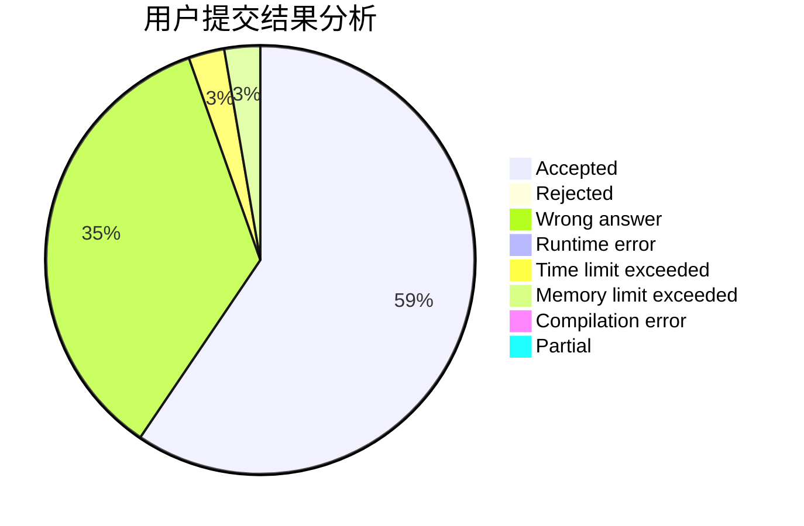
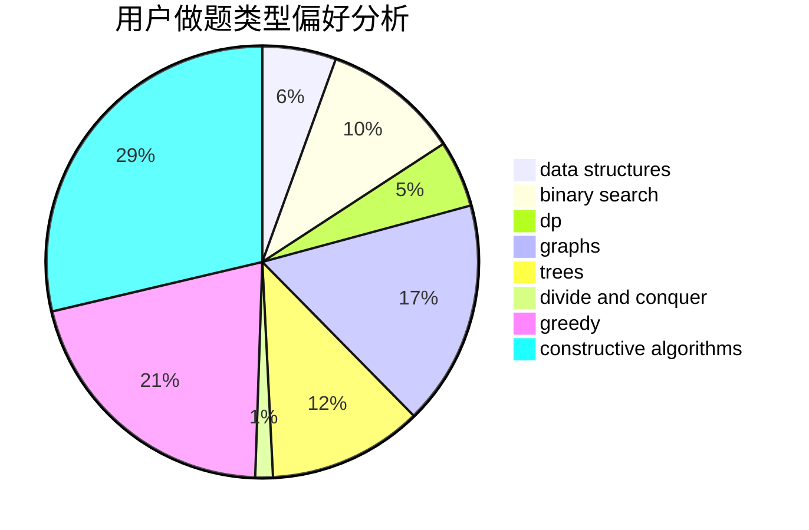
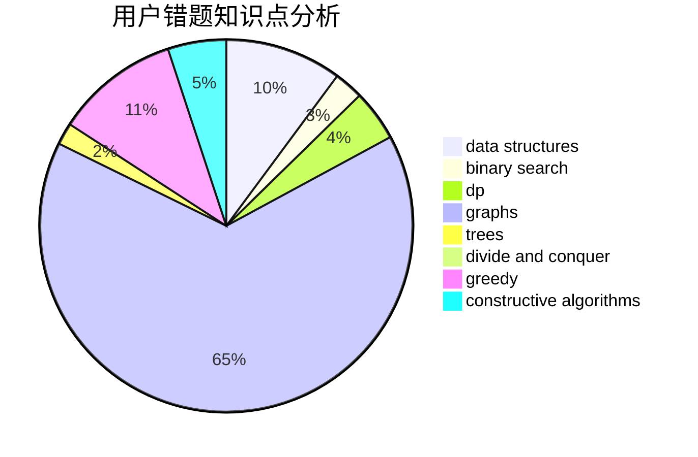

# gutc2019

<!-- tabs:start -->

#### **用户提交结果分析**

#### **用户做题类型偏好分析**

#### **用户错题知识点分析**

<!-- tabs:end -->
# 推荐题目
[253D](https://codeforces.com/contest/253/problem/D)		brute force,
                        two pointers		  
[799F](https://codeforces.com/contest/799/problem/F)		data structures		  
[706E](https://codeforces.com/contest/706/problem/E)		data structures,
                        implementation		  
[674F](https://codeforces.com/contest/674/problem/F)		dsu,graphs,sortings,trees		  
[482D](https://codeforces.com/contest/482/problem/D)		combinatorics,
                        dp,
                        trees		  
[614A](https://codeforces.com/contest/614/problem/A)		brute force,
                        implementation		  
[768A](https://codeforces.com/contest/768/problem/A)		constructive algorithms,
                        sortings		  
[1068D](https://codeforces.com/contest/1068/problem/D)		dsu,graphs,sortings,trees		  
[483E](https://codeforces.com/contest/483/problem/E)		dsu,graphs,sortings,trees		  
[919D](https://codeforces.com/contest/919/problem/D)		dfs and similar,
                        dp,
                        graphs		  
