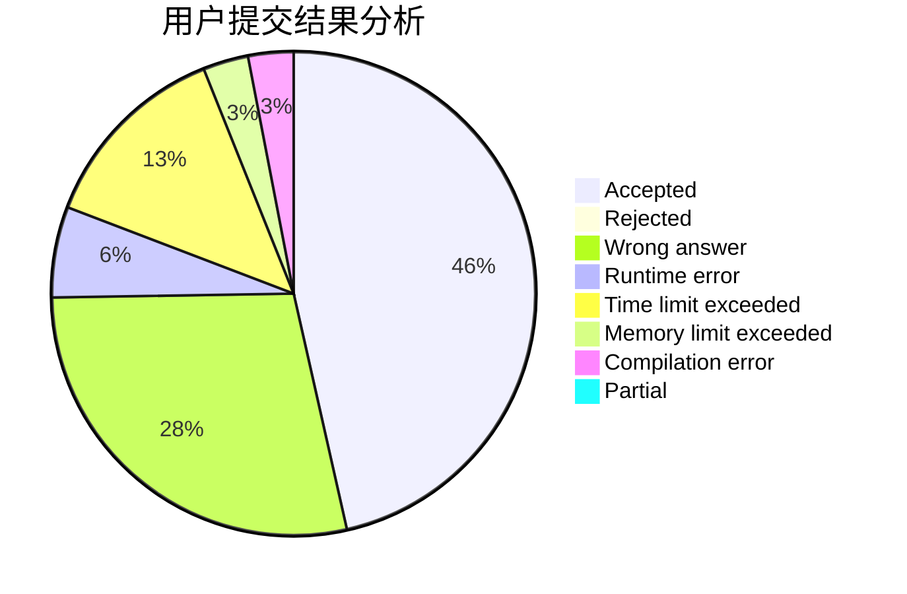
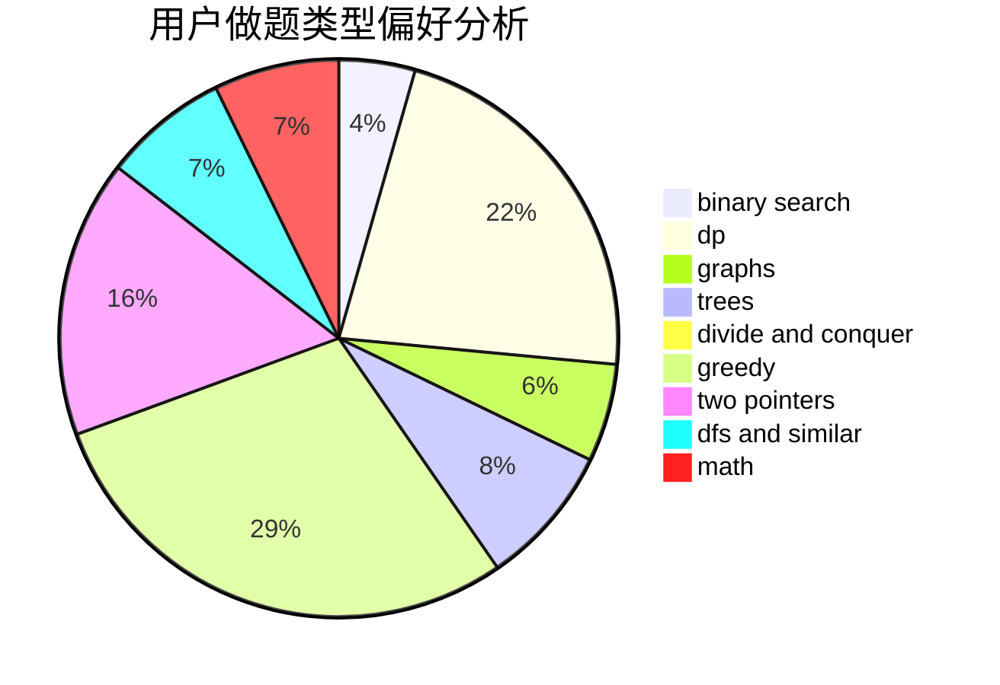

# gxy001

<!-- tabs:start -->

#### **用户提交结果分析**

#### **用户做题类型偏好分析**

<!-- tabs:end -->
# 推荐题目
[869E](https://codeforces.com/contest/869/problem/E)
[1444E](https://codeforces.com/contest/1444/problem/E)
[182D](https://codeforces.com/contest/182/problem/D)
[396C](https://codeforces.com/contest/396/problem/C)
[584B](https://codeforces.com/contest/584/problem/B)
[877C](https://codeforces.com/contest/877/problem/C)
[1402B](https://codeforces.com/contest/1402/problem/B)
[29E](https://codeforces.com/contest/29/problem/E)
[1293C](https://codeforces.com/contest/1293/problem/C)
[1016D](https://codeforces.com/contest/1016/problem/D)
