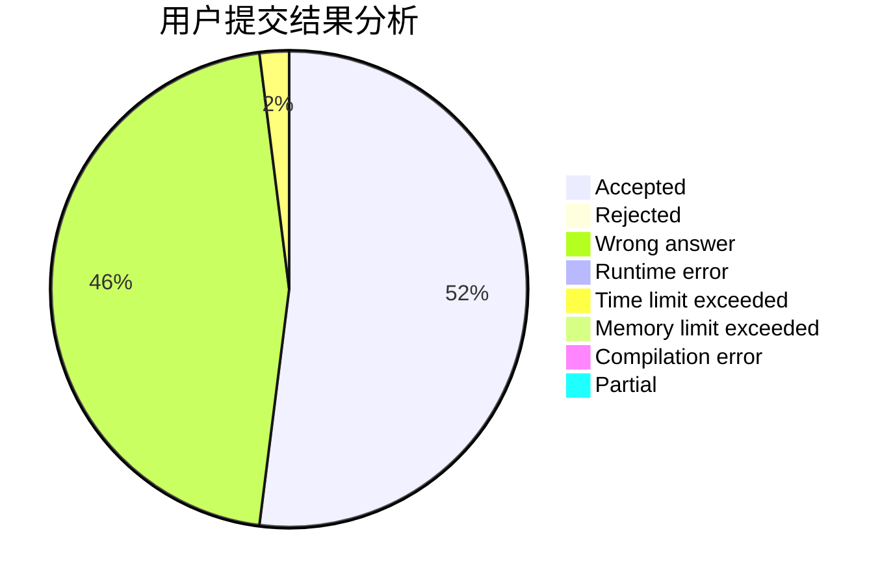
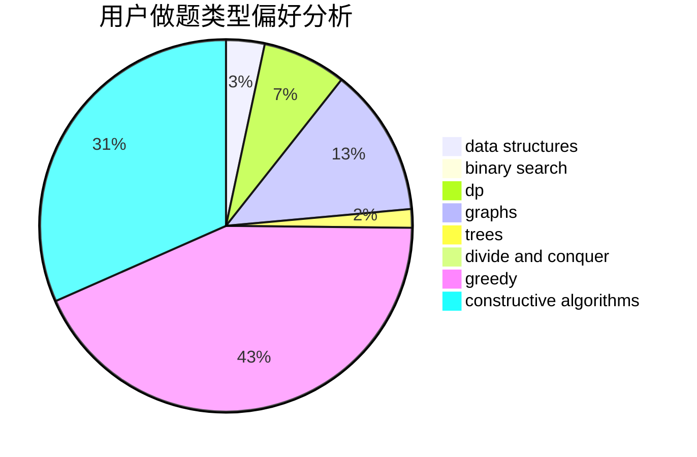
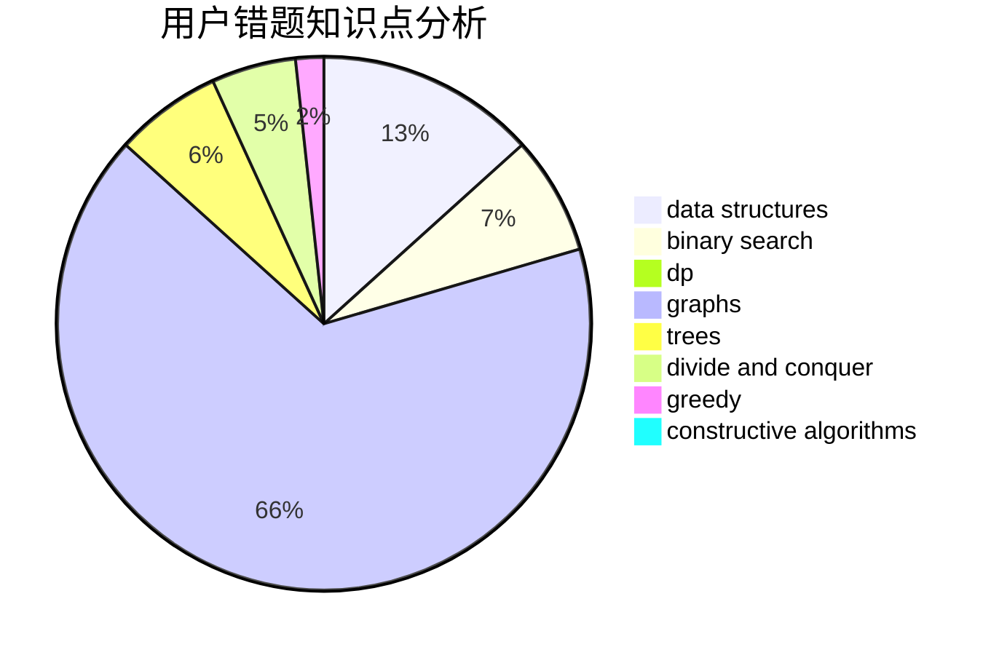

# gyf12138

<!-- tabs:start -->

#### **用户提交结果分析**

#### **用户做题类型偏好分析**

#### **用户错题知识点分析**

<!-- tabs:end -->
# 推荐题目
[1505C](https://codeforces.com/contest/1505/problem/C)		implementation		  
[575A](https://codeforces.com/contest/575/problem/A)		data structures,
                        math,
                        matrices		  
[1088B](https://codeforces.com/contest/1088/problem/B)		implementation,
                        sortings		  
[1149E](https://codeforces.com/contest/1149/problem/E)		games,
                        graphs		  
[666C](https://codeforces.com/contest/666/problem/C)		combinatorics,
                        strings		  
[436E](https://codeforces.com/contest/436/problem/E)		data structures,
                        greedy		  
[236D](https://codeforces.com/contest/236/problem/D)		dsu,graphs,sortings,trees		  
[35A](https://codeforces.com/contest/35/problem/A)		implementation		  
[497E](https://codeforces.com/contest/497/problem/E)		dp,
                        matrices		  
[1214G](https://codeforces.com/contest/1214/problem/G)		bitmasks,
                        data structures		  
